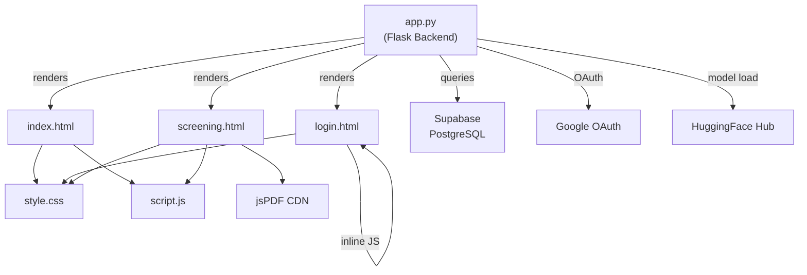

# 🔬 DEEP PROJECT TECHNICAL AUDIT — VisionAI Eye Diseases Classification

> **Audit Date:** 2026-08-17  
> **Auditor Role:** Senior Software Architect, Full-Stack Developer, Application Security Engineer  
> **Project:** VisionAI — AI-Powered Retinal Disease Screening System  
> **Repository:** `Eye_Diseases_Classification`

---

## Table of Contents

| # | Section |
|:---:|:---|
| 1 | [Executive Technical Summary](#1-executive-technical-summary) |
| 2 | [Actual Technology Stack](#2-actual-technology-stack) |
| 3 | [Repository Architecture](#3-repository-architecture) |
| 4 | [Dependency Map](#4-dependency-map) |
| 5 | [Feature Inventory](#5-feature-inventory) |
| 6 | [Current Architecture](#6-current-architecture) |
| 7 | [Data-Flow Analysis](#7-data-flow-analysis) |
| 8 | [Control-Flow Analysis](#8-control-flow-analysis) |
| 9 | [Authentication Analysis](#9-authentication-analysis) |
| 10 | [Authorization Analysis](#10-authorization-analysis) |
| 11 | [Database Analysis](#11-database-analysis) |
| 12 | [API / Backend Analysis](#12-api--backend-analysis) |
| 13 | [Frontend Architecture Analysis](#13-frontend-architecture-analysis) |
| 14 | [External Integration Analysis](#14-external-integration-analysis) |
| 15 | [Security Audit](#15-security-audit) |
| 16 | [Performance Audit](#16-performance-audit) |
| 17 | [Error Handling Analysis](#17-error-handling-analysis) |
| 18 | [Edge-Case Analysis](#18-edge-case-analysis) |
| 19 | [Code Quality Analysis](#19-code-quality-analysis) |
| 20 | [Architectural Conflicts](#20-architectural-conflicts) |
| 21 | [Root-Cause Analysis](#21-root-cause-analysis) |
| 22 | [Critical Issues](#22-critical-issues) |
| 23 | [Major Issues](#23-major-issues) |
| 24 | [Minor Issues](#24-minor-issues) |
| 25 | [Recommended Target Architecture](#25-recommended-target-architecture) |
| 26 | [Optimization Strategy](#26-optimization-strategy) |
| 27 | [Technical Remediation Plan](#27-technical-remediation-plan) |
| 28 | [Implementation Dependencies](#28-implementation-dependencies) |
| 29 | [Vibe-Coding Prompts](#29-vibe-coding-prompts) |
| 30 | [Prompt Execution Order](#30-prompt-execution-order) |
| 31 | [Validation Strategy](#31-validation-strategy) |
| 32 | [Production Readiness Checklist](#32-production-readiness-checklist) |

---

# 1. Executive Technical Summary

**VisionAI** is a Flask-based monolithic web application that performs AI-powered retinal image classification for eye disease detection. It uses a HuggingFace-hosted EfficientNetB0 model (`NeuronZero/EyeDiseaseClassifier`) for local inference, Supabase (PostgreSQL) for user persistence, Google OAuth for social login, and a vanilla HTML/CSS/JS frontend with Jinja2 templating.

### Overall Assessment

| Dimension | Rating | Summary |
|:---|:---:|:---|
| **Core Functionality** | 🟢 Functional | Image upload → AI prediction → results display works end-to-end |
| **Authentication** | 🟡 Partial | Works but has critical security gaps (no CSRF, race conditions in ID generation) |
| **Security** | 🔴 Critical | No CSRF, no rate limiting, CORS wildcard, hardcoded OAuth redirect, false HIPAA claims |
| **Architecture** | 🟡 Adequate | Monolith is acceptable at this scale, but has tight coupling and code duplication |
| **Performance** | 🟡 Adequate | Synchronous model loading blocks startup; no caching; adequate for low traffic |
| **Error Handling** | 🟡 Partial | Happy path covered; error internals leak to client; several unhandled edge cases |
| **Code Quality** | 🟡 Adequate | Readable but has duplicated code across templates and no tests |
| **Production Readiness** | 🔴 Not Ready | Multiple critical security issues must be resolved before any production deployment |

### Critical Issue Count

| Severity | Count |
|:---:|:---:|
| 🔴 CRITICAL | 7 |
| 🟠 MAJOR | 10 |
| 🟡 MINOR | 8 |

---

# 2. Actual Technology Stack

| Layer | Technology | Version Constraint | Evidence |
|:---|:---|:---|:---|
| **Runtime** | Python | 3.9+ (implied) | `requirements.txt` |
| **Web Framework** | Flask | >=2.3.0 | [app.py:9](file:///c:/Users/chkar/Desktop/Eye_Diseases_Classification/app.py#L9) |
| **CORS** | Flask-CORS | >=4.0.0 | [app.py:10](file:///c:/Users/chkar/Desktop/Eye_Diseases_Classification/app.py#L10) |
| **Auth (session)** | Flask-Login | >=0.6.0 | [app.py:11](file:///c:/Users/chkar/Desktop/Eye_Diseases_Classification/app.py#L11) |
| **Password Hashing** | Werkzeug (scrypt/pbkdf2) | >=3.0.0 | [app.py:12](file:///c:/Users/chkar/Desktop/Eye_Diseases_Classification/app.py#L12) |
| **OAuth** | Authlib | >=1.3.0 | [app.py:19](file:///c:/Users/chkar/Desktop/Eye_Diseases_Classification/app.py#L19) |
| **AI Framework** | PyTorch | >=2.0.0 | [app.py:15](file:///c:/Users/chkar/Desktop/Eye_Diseases_Classification/app.py#L15) |
| **AI Model Hub** | HuggingFace Transformers | >=4.30.0 | [app.py:16](file:///c:/Users/chkar/Desktop/Eye_Diseases_Classification/app.py#L16) |
| **Image Processing** | Pillow | >=10.0.0 | [app.py:17](file:///c:/Users/chkar/Desktop/Eye_Diseases_Classification/app.py#L17) |
| **Database** | Supabase (PostgreSQL) | >=2.0.0 | [app.py:20](file:///c:/Users/chkar/Desktop/Eye_Diseases_Classification/app.py#L20) |
| **Frontend** | Vanilla HTML/CSS/JS + Jinja2 | — | `templates/`, `static/` |
| **PDF Generation** | jsPDF (CDN) | 2.5.1 | [screening.html:194](file:///c:/Users/chkar/Desktop/Eye_Diseases_Classification/templates/screening.html#L194) |
| **Env Management** | python-dotenv | >=1.0.0 | [app.py:6](file:///c:/Users/chkar/Desktop/Eye_Diseases_Classification/app.py#L6) |
| **WSGI (production)** | Gunicorn | >=21.0.0 | [requirements.txt:35](file:///c:/Users/chkar/Desktop/Eye_Diseases_Classification/requirements.txt#L35) |

### Unused Dependencies (in `requirements.txt` but never imported)

| Dependency | Status | Evidence |
|:---|:---|:---|
| `requests>=2.31.0` | **UNUSED** | Not imported anywhere in `app.py` |
| `gspread>=5.12.0` | **UNUSED** | Not imported anywhere in `app.py` |
| `google-auth>=2.25.0` | **UNUSED** | Not imported anywhere in `app.py` |
| `google-auth-oauthlib>=1.2.0` | **UNUSED** | Not imported anywhere in `app.py` |

---

# 3. Repository Architecture

```
Eye_Diseases_Classification/
├── app.py                      # Monolithic backend (320 lines) — ALL server logic
├── requirements.txt            # Python dependencies (36 lines)
├── .env.example                # Environment variable template
├── .gitignore                  # Git ignore rules
├── README.md                   # Comprehensive documentation (840 lines)
├── assets/                     # README images only
│   ├── folder_structure.png
│   ├── tech_stack.png
│   └── workflow.png
├── templates/                  # Jinja2 HTML templates
│   ├── index.html              # Landing page (705 lines)
│   ├── login.html              # Auth page (691 lines)
│   └── screening.html          # AI screening page (433 lines)
└── static/                     # Client-side assets
    ├── script.js               # All client logic (1020 lines)
    └── style.css               # All styles (1764 lines)
```

### File Interaction Map



---

# 4. Dependency Map

### Direct Dependencies (Used)

```
app.py
├── flask (Flask, render_template, request, jsonify, redirect, url_for, flash)
├── flask_cors (CORS)
├── flask_login (LoginManager, UserMixin, login_user, logout_user, login_required, current_user)
├── werkzeug.security (generate_password_hash, check_password_hash)
├── werkzeug.utils (secure_filename)
├── torch (inference)
├── transformers (AutoImageProcessor, AutoModelForImageClassification)
├── PIL (Image)
├── authlib.integrations.flask_client (OAuth)
├── supabase (create_client, Client)
├── dotenv (load_dotenv)
└── os, secrets, datetime (stdlib)
```

### Unused Dependencies

```
requirements.txt (declared but never imported)
├── requests        ← NOT used in any .py file
├── gspread         ← NOT used in any .py file
├── google-auth     ← NOT used in any .py file
└── google-auth-oauthlib ← NOT used in any .py file
```

### Circular Dependencies: None detected (single-file monolith)
### Dependency Duplication: None detected

---

# 5. Feature Inventory

| # | Feature | Status | Entry Point | Evidence |
|:---:|:---|:---:|:---|:---|
| 1 | Landing page | ✅ Fully Implemented | `GET /` → `index.html` | [app.py:234-236](file:///c:/Users/chkar/Desktop/Eye_Diseases_Classification/app.py#L234-L236) |
| 2 | User registration (email/password) | ✅ Fully Implemented | `POST /auth/register` | [app.py:145-164](file:///c:/Users/chkar/Desktop/Eye_Diseases_Classification/app.py#L145-L164) |
| 3 | User login (email/password) | ✅ Fully Implemented | `POST /auth/login` | [app.py:166-176](file:///c:/Users/chkar/Desktop/Eye_Diseases_Classification/app.py#L166-L176) |
| 4 | Google OAuth login | ✅ Fully Implemented | `GET /auth/google` | [app.py:178-216](file:///c:/Users/chkar/Desktop/Eye_Diseases_Classification/app.py#L178-L216) |
| 5 | Logout | ✅ Fully Implemented | `GET /auth/logout` | [app.py:218-222](file:///c:/Users/chkar/Desktop/Eye_Diseases_Classification/app.py#L218-L222) |
| 6 | Auth status check | ✅ Fully Implemented | `GET /auth/status` | [app.py:224-230](file:///c:/Users/chkar/Desktop/Eye_Diseases_Classification/app.py#L224-L230) |
| 7 | AI screening page (protected) | ✅ Fully Implemented | `GET /screening` | [app.py:238-241](file:///c:/Users/chkar/Desktop/Eye_Diseases_Classification/app.py#L238-L241) |
| 8 | Image upload + AI prediction | ✅ Fully Implemented | `POST /predict` | [app.py:243-286](file:///c:/Users/chkar/Desktop/Eye_Diseases_Classification/app.py#L243-L286) |
| 9 | Disease knowledge base (client) | ✅ Fully Implemented | JS object | [script.js:11-312](file:///c:/Users/chkar/Desktop/Eye_Diseases_Classification/static/script.js#L11-L312) — 12 disease entries |
| 10 | Results display with tabs | ✅ Fully Implemented | JS rendering | [script.js:535-631](file:///c:/Users/chkar/Desktop/Eye_Diseases_Classification/static/script.js#L535-L631) |
| 11 | PDF report download | ✅ Fully Implemented | JS generation | [script.js:686-981](file:///c:/Users/chkar/Desktop/Eye_Diseases_Classification/static/script.js#L686-L981) |
| 12 | Dark mode toggle | ✅ Fully Implemented | JS + localStorage | [script.js:382-405](file:///c:/Users/chkar/Desktop/Eye_Diseases_Classification/static/script.js#L382-L405) |
| 13 | Health check endpoint | ✅ Fully Implemented | `GET /health` | [app.py:288-292](file:///c:/Users/chkar/Desktop/Eye_Diseases_Classification/app.py#L288-L292) |
| 14 | Config endpoint | ✅ Fully Implemented | `GET /config` | [app.py:294-298](file:///c:/Users/chkar/Desktop/Eye_Diseases_Classification/app.py#L294-L298) |
| 15 | Drag-and-drop upload | ✅ Fully Implemented | JS events | [script.js:426-433](file:///c:/Users/chkar/Desktop/Eye_Diseases_Classification/static/script.js#L426-L433) |
| 16 | Smooth scroll navigation | ✅ Fully Implemented | JS listener | [script.js:333-376](file:///c:/Users/chkar/Desktop/Eye_Diseases_Classification/static/script.js#L333-L376) |
| 17 | Google Sheets logging | ❌ Dead/Removed | `.env.example:17-20` | Dependency in requirements.txt but no code |
| 18 | Documentation/API/FAQ pages | ❌ Placeholder | `index.html:472-475` | Links all point to `#` |
| 19 | Privacy/Terms/Disclaimer pages | ❌ Placeholder | `index.html:479-482` | Links all point to `#` |
| 20 | User profile/history | ❌ Missing | — | No route or UI exists |

---

# 6. Current Architecture

### Reconstructed Layer Map

```
┌──────────────────────────────────────────────────────────┐
│                    PRESENTATION LAYER                     │
│  index.html │ login.html │ screening.html │ style.css     │
│  script.js (1020 lines — UI + logic + PDF + knowledge)   │
└────────────────────────┬─────────────────────────────────┘
                         │ HTTP (fetch / form)
┌────────────────────────▼─────────────────────────────────┐
│                   APPLICATION LAYER                       │
│  app.py (ALL of the following in 320 lines):              │
│  ┌──────────┐ ┌───────────┐ ┌────────────┐ ┌──────────┐ │
│  │  Routes   │ │   Auth    │ │  AI Model  │ │  Config  │ │
│  └──────────┘ └───────────┘ └────────────┘ └──────────┘ │
│  ┌──────────┐ ┌───────────┐ ┌────────────┐              │
│  │  User    │ │ DB Access │ │   Error    │              │
│  │  Model   │ │ (Direct)  │ │  Handlers  │              │
│  └──────────┘ └───────────┘ └────────────┘              │
└────────────────────────┬─────────────────────────────────┘
                         │
┌────────────────────────▼─────────────────────────────────┐
│                   EXTERNAL SERVICES                       │
│  Supabase (PostgreSQL)  │  Google OAuth  │  HuggingFace  │
└──────────────────────────────────────────────────────────┘
```

### Architectural Findings

| Finding | Type | Evidence | Impact |
|:---|:---:|:---|:---|
| All server logic in single file | Tight coupling | [app.py](file:///c:/Users/chkar/Desktop/Eye_Diseases_Classification/app.py) (320 lines): routes, auth, AI, DB, config, errors | Manageable at current scale but blocks parallel development |
| Business logic in UI | Mixed concerns | [script.js:11-312](file:///c:/Users/chkar/Desktop/Eye_Diseases_Classification/static/script.js#L11-L312): 12-disease medical knowledge base hardcoded in JS | Knowledge cannot be updated without frontend deployment |
| Duplicated user menu CSS | DRY violation | [index.html:512-701](file:///c:/Users/chkar/Desktop/Eye_Diseases_Classification/templates/index.html#L512-L701) and [screening.html:212-429](file:///c:/Users/chkar/Desktop/Eye_Diseases_Classification/templates/screening.html#L212-L429) | Maintenance burden; changes must be made in 2+ places |
| Duplicated user dropdown JS | DRY violation | [index.html:496-508](file:///c:/Users/chkar/Desktop/Eye_Diseases_Classification/templates/index.html#L496-L508) and [screening.html:197-209](file:///c:/Users/chkar/Desktop/Eye_Diseases_Classification/templates/screening.html#L197-L209) | Same logic copy-pasted in two templates |
| Direct DB access from route handlers | No service layer | [app.py:120-130](file:///c:/Users/chkar/Desktop/Eye_Diseases_Classification/app.py#L120-L130): `supabase.table('users').select('*')` directly in routes | No abstraction between routes and data access |
| PDF generation coupled to client | No server-side PDF | [script.js:686-981](file:///c:/Users/chkar/Desktop/Eye_Diseases_Classification/static/script.js#L686-L981): 295 lines of PDF generation logic in browser | Cannot generate reports server-side; no report history |

---

# 7. Data-Flow Analysis

### Flow 1: User Registration

```
User Input (name, email, password)
 ↓
Client Validation (login.html:632-679)
  - Password length >= 8 (client-side)
  - Password confirmation match (client-side)
 ↓
POST /auth/register (JSON body)
 ↓
Server Validation (app.py:152-157)
  - Empty field check
  - Password length >= 8
  - Duplicate email check (DB query)
 ↓
User ID Generation (app.py:128-130)
  ⚠️ RACE CONDITION: SELECT count → increment → INSERT
 ↓
Password Hashing (werkzeug generate_password_hash)
 ↓
Supabase UPSERT (app.py:110-115)
  ⚠️ UPSERT can overwrite existing records if ID collides
 ↓
Flask-Login session (login_user)
 ↓
JSON Response → Client redirect to /screening
```

**Issues in this flow:**
- ❌ No CSRF token
- ❌ Race condition in `get_next_user_id()` — two concurrent registrations can get the same ID
- ❌ No email format validation beyond "not empty"
- ❌ No password complexity rules beyond length
- ❌ `upsert` instead of `insert` — can silently overwrite existing user if ID collides

### Flow 2: AI Image Prediction

```
User selects/drops image file
 ↓
Client Validation (script.js:456-462)
  - MIME type check
  - File size <= 16MB
 ↓
Auto-trigger analyze() after 500ms delay (script.js:451)
 ↓
POST /predict (multipart/form-data, with session cookie)
 ↓
Server Validation (app.py:246-257)
  - Model loaded check
  - File presence check
  - Extension whitelist check
 ↓
File saved to disk (app.py:261-263)
  ⚠️ secure_filename can collide for concurrent uploads
 ↓
PIL Image.open → RGB convert (app.py:265)
 ↓
AutoImageProcessor → PyTorch inference (app.py:266-268)
 ↓
torch.softmax → sorted predictions (app.py:270-275)
 ↓
JSON response with predictions array
 ↓
File deleted in finally block (app.py:283-286) ✅
 ↓
Client: getDisease() maps label → knowledge base (script.js:988-1008)
 ↓
Client: showResults() renders cards + tabs (script.js:535-598)
```

**Issues in this flow:**
- ❌ File saved to shared `uploads/` directory — concurrent users with same filename overwrite each other
- ❌ No request timeout configuration
- ❌ Error message in catch block leaks exception string to client: `jsonify({'error': str(e)})` at [app.py:282](file:///c:/Users/chkar/Desktop/Eye_Diseases_Classification/app.py#L282)
- ✅ File cleanup in `finally` block is correct

### Flow 3: Google OAuth

```
User clicks "Continue with Google"
 ↓
GET /auth/google (app.py:178-184)
 ↓
⚠️ Hardcoded redirect_uri: 'http://localhost:5000/auth/google/callback'
 ↓
Google consent screen
 ↓
GET /auth/google/callback (app.py:186-216)
 ↓
Token exchange + userinfo extraction
 ↓
Check existing user by email → login or create
 ↓
Redirect to /screening
```

**Issues in this flow:**
- ❌ Hardcoded `http://localhost:5000` redirect URI — breaks in any non-localhost deployment
- ❌ No HTTPS enforcement — OAuth tokens sent over plaintext HTTP

---

# 8. Control-Flow Analysis

### Route Protection Map

| Route | Method | Auth Required | Implementation |
|:---|:---:|:---:|:---|
| `GET /` | GET | ❌ No | Public landing page |
| `GET /login` | GET | ❌ No | Login page (redirects if already authed) |
| `POST /auth/register` | POST | ❌ No | Registration endpoint |
| `POST /auth/login` | POST | ❌ No | Login endpoint |
| `GET /auth/google` | GET | ❌ No | OAuth initiation |
| `GET /auth/google/callback` | GET | ❌ No | OAuth callback |
| `GET /auth/logout` | GET | ✅ Yes | `@login_required` |
| `GET /auth/status` | GET | ❌ No | Returns auth state (intentional) |
| `GET /screening` | GET | ✅ Yes | `@login_required` |
| `POST /predict` | POST | ✅ Yes | `@login_required` |
| `GET /health` | GET | ❌ No | Health check |
| `GET /config` | GET | ❌ No | ⚠️ Exposes configuration details publicly |

### Unauthorized Handler

The `unauthorized_callback` ([app.py:48-53](file:///c:/Users/chkar/Desktop/Eye_Diseases_Classification/app.py#L48-L53)) correctly differentiates JSON API requests from browser requests:
- JSON/multipart → returns 401 JSON
- Browser → redirects to `/login`

---

# 9. Authentication Analysis

### Registration Flow
- **Mechanism:** Email/password with Werkzeug hashing ([app.py:160](file:///c:/Users/chkar/Desktop/Eye_Diseases_Classification/app.py#L160))
- **Password storage:** `generate_password_hash(password)` — uses scrypt by default in Werkzeug >=3.0 ✅
- **Session:** Flask-Login server-side session via signed cookie ✅

### Login Flow
- **Mechanism:** Email lookup → `check_password_hash` comparison ([app.py:172](file:///c:/Users/chkar/Desktop/Eye_Diseases_Classification/app.py#L172))
- **Session creation:** `login_user(user)` ([app.py:174](file:///c:/Users/chkar/Desktop/Eye_Diseases_Classification/app.py#L174))

### Google OAuth Flow
- **Provider:** Google OpenID Connect via Authlib ([app.py:55-60](file:///c:/Users/chkar/Desktop/Eye_Diseases_Classification/app.py#L55-L60))
- **Conditional init:** Only registers if `GOOGLE_CLIENT_ID` is set ✅
- **User creation:** Auto-creates user on first Google login ([app.py:202-208](file:///c:/Users/chkar/Desktop/Eye_Diseases_Classification/app.py#L202-L208))

### Session Management
- **Type:** Flask server-side session with signed cookie
- **Secret key:** `os.environ.get('SECRET_KEY', secrets.token_hex(32))` ([app.py:25](file:///c:/Users/chkar/Desktop/Eye_Diseases_Classification/app.py#L25))
  - ⚠️ **Fallback generates random key on each restart → invalidates ALL sessions**
- **Expiration:** Not configured — uses Flask-Login defaults (session-based, expires on browser close)
- **Remember me:** Not implemented

### Authentication Issues

| Issue | Severity | Evidence |
|:---|:---:|:---|
| Secret key regenerates on restart | 🔴 CRITICAL | [app.py:25](file:///c:/Users/chkar/Desktop/Eye_Diseases_Classification/app.py#L25) — `secrets.token_hex(32)` fallback |
| No CSRF protection | 🔴 CRITICAL | No `Flask-WTF` or CSRF tokens anywhere |
| No rate limiting on login/register | 🔴 CRITICAL | No `Flask-Limiter` or equivalent |
| Race condition in user ID generation | 🔴 CRITICAL | [app.py:128-130](file:///c:/Users/chkar/Desktop/Eye_Diseases_Classification/app.py#L128-L130) — TOCTOU |
| Hardcoded OAuth redirect URI | 🟠 MAJOR | [app.py:183](file:///c:/Users/chkar/Desktop/Eye_Diseases_Classification/app.py#L183) — `http://localhost:5000` |
| No session timeout | 🟠 MAJOR | No `PERMANENT_SESSION_LIFETIME` configured |
| No password complexity | 🟡 MINOR | Only `len(password) < 8` check |

---

# 10. Authorization Analysis

### Current Authorization Model

The application has a `role` field on the User model ([app.py:85](file:///c:/Users/chkar/Desktop/Eye_Diseases_Classification/app.py#L85)) with a default of `'patient'`, but **no authorization logic exists anywhere in the codebase**.

| Authorization Check | Implemented? | Evidence |
|:---|:---:|:---|
| Route-level role checking | ❌ No | No `@role_required` decorator exists |
| Admin routes | ❌ No | No admin functionality exists |
| User data isolation | ❌ No | No user-scoped queries; `select('*')` everywhere |
| Row-level security (Supabase RLS) | **Not verified** | Cannot determine from codebase alone |

The `role` field is stored but never checked. Any authenticated user has identical permissions. This is acceptable for the current single-role application, but the presence of the field suggests planned RBAC that was never implemented.

---

# 11. Database Analysis

### Database: Supabase (PostgreSQL)

**Connection:** `supabase = create_client(Config.SUPABASE_URL, Config.SUPABASE_KEY)` at [app.py:64](file:///c:/Users/chkar/Desktop/Eye_Diseases_Classification/app.py#L64)

### Inferred Schema (from code at [app.py:110-115](file:///c:/Users/chkar/Desktop/Eye_Diseases_Classification/app.py#L110-L115))

**Table: `users`**

| Column | Type (inferred) | Constraints | Evidence |
|:---|:---|:---|:---|
| `id` | TEXT | Primary Key | `app.py:111` — e.g., `user_1`, `google_1` |
| `email` | TEXT | Unique (assumed) | `app.py:125` — queried by `.eq('email', email)` |
| `name` | TEXT | NOT NULL (assumed) | `app.py:111` |
| `phone` | TEXT | Nullable | `app.py:84` — default `None` |
| `password_hash` | TEXT | Nullable | `app.py:112` — NULL for Google OAuth users |
| `login_method` | TEXT | Default 'password' | `app.py:103` |
| `role` | TEXT | Default 'patient' | `app.py:104` |
| `is_active` | BOOLEAN | Default TRUE | `app.py:104` |
| `last_login` | TEXT/TIMESTAMP | Nullable | `app.py:113` |
| `created_at` | TEXT/TIMESTAMP | Auto-set | `app.py:114` |

### Database Issues

| Issue | Severity | Evidence | Impact |
|:---|:---:|:---|:---|
| **Race condition in ID generation** | 🔴 CRITICAL | [app.py:128-130](file:///c:/Users/chkar/Desktop/Eye_Diseases_Classification/app.py#L128-L130): `SELECT count → +1` | Two concurrent registrations get same ID; `upsert` silently overwrites |
| **UPSERT instead of INSERT** | 🟠 MAJOR | [app.py:110](file:///c:/Users/chkar/Desktop/Eye_Diseases_Classification/app.py#L110): `supabase.table('users').upsert(...)` | If IDs collide, user data is silently overwritten |
| **No uniqueness enforced in code** | 🟠 MAJOR | Email uniqueness checked by app query ([app.py:156](file:///c:/Users/chkar/Desktop/Eye_Diseases_Classification/app.py#L156)) not DB constraint | Race condition between check and insert |
| **`SELECT *` exposes password_hash** | 🟠 MAJOR | [app.py:121,125](file:///c:/Users/chkar/Desktop/Eye_Diseases_Classification/app.py#L121) | If Supabase anon key leaks, all password hashes exposed |
| **String-based timestamps** | 🟡 MINOR | [app.py:114](file:///c:/Users/chkar/Desktop/Eye_Diseases_Classification/app.py#L114): `strftime('%Y-%m-%d %H:%M:%S')` | Timezone-unaware; comparison/sorting issues |
| **No migration strategy** | 🟡 MINOR | No Alembic or migration files | Schema changes must be manual |

---

# 12. API / Backend Analysis

### Endpoint Inventory

| Endpoint | Method | Auth | Content-Type | Response |
|:---|:---:|:---:|:---|:---|
| `/` | GET | No | HTML | Landing page |
| `/login` | GET | No | HTML | Login page |
| `/screening` | GET | Yes | HTML | Screening page |
| `/auth/register` | POST | No | JSON | `{success, message, user}` |
| `/auth/login` | POST | No | JSON | `{success, message, user}` |
| `/auth/google` | GET | No | Redirect | OAuth initiation |
| `/auth/google/callback` | GET | No | Redirect | OAuth completion |
| `/auth/logout` | GET | Yes | Redirect | Logout → home |
| `/auth/status` | GET | No | JSON | `{authenticated, user?}` |
| `/predict` | POST | Yes | JSON | `{success, predictions, model}` |
| `/health` | GET | No | JSON | `{status, model_loaded}` |
| `/config` | GET | No | JSON | `{model, maxFileSize, formats}` |

### API Issues

| Issue | Evidence | Impact |
|:---|:---|:---|
| No API versioning | All routes at `/` root | Breaking changes affect all clients |
| Error responses leak internals | [app.py:282](file:///c:/Users/chkar/Desktop/Eye_Diseases_Classification/app.py#L282): `'error': str(e)` | Stack traces / internal paths exposed |
| `/config` exposes details publicly | [app.py:294-298](file:///c:/Users/chkar/Desktop/Eye_Diseases_Classification/app.py#L294-L298) | Model name, maxFileSize, formats publicly accessible |
| Logout uses GET | [app.py:218](file:///c:/Users/chkar/Desktop/Eye_Diseases_Classification/app.py#L218) | Susceptible to CSRF (prefetch/crawlers can trigger logout) |

---

# 13. Frontend Architecture Analysis

### Component Structure

| File | Lines | Responsibility | Issues |
|:---|:---:|:---|:---|
| [index.html](file:///c:/Users/chkar/Desktop/Eye_Diseases_Classification/templates/index.html) | 705 | Landing page + inline user menu CSS/JS | 190 lines of inline `<style>` + `<script>` |
| [login.html](file:///c:/Users/chkar/Desktop/Eye_Diseases_Classification/templates/login.html) | 691 | Auth forms + inline CSS/JS | 415 lines of inline `<style>`, 122 lines of inline `<script>` |
| [screening.html](file:///c:/Users/chkar/Desktop/Eye_Diseases_Classification/templates/screening.html) | 433 | AI screening tool + inline CSS/JS | 218 lines of inline `<style>`, 14 lines of inline `<script>` |
| [style.css](file:///c:/Users/chkar/Desktop/Eye_Diseases_Classification/static/style.css) | 1764 | Shared design system + component styles | Well-structured with CSS variables |
| [script.js](file:///c:/Users/chkar/Desktop/Eye_Diseases_Classification/static/script.js) | 1020 | All client logic | God file — multiple concerns mixed |

### Design System

The CSS design system in [style.css](file:///c:/Users/chkar/Desktop/Eye_Diseases_Classification/static/style.css) is **well-implemented**:
- ✅ CSS custom properties for colors, spacing, radius, shadows, typography
- ✅ Dark mode support via `data-theme="dark"` attribute and `prefers-color-scheme` media query
- ✅ Responsive breakpoints
- ✅ Consistent naming convention

### Frontend Issues

| Issue | Type | Evidence |
|:---|:---:|:---|
| Inline styles duplicated across templates | DRY violation | User menu CSS identical in [index.html:512-701](file:///c:/Users/chkar/Desktop/Eye_Diseases_Classification/templates/index.html#L512-L701) and [screening.html:212-429](file:///c:/Users/chkar/Desktop/Eye_Diseases_Classification/templates/screening.html#L212-L429) |
| Inline JS duplicated across templates | DRY violation | User dropdown toggle identical in [index.html:496-508](file:///c:/Users/chkar/Desktop/Eye_Diseases_Classification/templates/index.html#L496-L508) and [screening.html:197-209](file:///c:/Users/chkar/Desktop/Eye_Diseases_Classification/templates/screening.html#L197-L209) |
| `script.js` is a God file | Excessive scope | 1020 lines: nav + theme + upload + analysis + results + PDF + disease DB |
| Disease knowledge base hardcoded in JS | Tight coupling | [script.js:11-312](file:///c:/Users/chkar/Desktop/Eye_Diseases_Classification/static/script.js#L11-L312): 302 lines of medical content in client code |
| No template partials | DRY violation | Navbar, footer, head elements duplicated across all 3 templates |

---

# 14. External Integration Analysis

### 1. Supabase (Database)

| Aspect | Implementation | Issues |
|:---|:---|:---|
| Connection | `create_client(URL, KEY)` at module level | Crashes on startup if credentials invalid |
| Operations | `select`, `upsert`, `eq` | No retry logic |
| Error handling | Try/catch with print | Errors not surfaced to user |

### 2. Google OAuth

| Aspect | Implementation | Issues |
|:---|:---|:---|
| Provider config | Authlib OpenID Connect | ✅ Correctly uses `server_metadata_url` |
| Redirect URI | Hardcoded `http://localhost:5000` | ❌ Breaks in production |
| Conditional init | `if Config.GOOGLE_CLIENT_ID` | ✅ Graceful degradation |

### 3. HuggingFace Model

| Aspect | Implementation | Issues |
|:---|:---|:---|
| Model ID | `NeuronZero/EyeDiseaseClassifier` | Downloaded on first run |
| Loading | Synchronous at startup | ❌ Blocks server for minutes |
| Fallback | `MODEL_LOADED = False` flag | ✅ Returns 503 if unavailable |

### 4. jsPDF (CDN)

| Aspect | Implementation | Issues |
|:---|:---|:---|
| Source | `cdnjs.cloudflare.com` | External dependency |
| Usage | Client-side PDF generation | ❌ No SRI hash |
| Fallback | None | ❌ PDF fails silently if CDN down |

### 5. Google Sheets (DEAD)

Referenced in [.env.example:17-20](file:///c:/Users/chkar/Desktop/Eye_Diseases_Classification/.env.example#L17-L20) and [requirements.txt:23-26](file:///c:/Users/chkar/Desktop/Eye_Diseases_Classification/requirements.txt#L23-L26) but **no implementation exists in the codebase**.

---

# 15. Security Audit

## SEC-01: No CSRF Protection

| Field | Value |
|:---|:---|
| **Severity** | 🔴 CRITICAL |
| **Location** | [app.py](file:///c:/Users/chkar/Desktop/Eye_Diseases_Classification/app.py) (entire application), [login.html:598-679](file:///c:/Users/chkar/Desktop/Eye_Diseases_Classification/templates/login.html#L598-L679) |
| **Evidence** | No `Flask-WTF`, no CSRF tokens in forms, no CSRF middleware. All state-changing operations (register, login, predict, logout) have no CSRF defense. |
| **Attack Scenario** | Attacker crafts a page that auto-submits POST to `/auth/register` or `/predict` using the victim's session cookie. The `CORS(app)` wildcard means cross-origin requests are unrestricted. |
| **Root Cause** | CSRF protection was never implemented. |
| **Impact** | Account creation, login hijacking, and unauthorized predictions can be triggered from any malicious website. |
| **Remediation** | Add `Flask-WTF` with CSRF protection. Include CSRF tokens in all forms and AJAX headers. Restrict CORS origins. |
| **Validation** | Verify cross-origin POST requests without CSRF token are rejected with 403. |

## SEC-02: CORS Wildcard with Authentication

| Field | Value |
|:---|:---|
| **Severity** | 🔴 CRITICAL |
| **Location** | [app.py:40](file:///c:/Users/chkar/Desktop/Eye_Diseases_Classification/app.py#L40) — `CORS(app)` |
| **Evidence** | `CORS(app)` with no arguments enables all origins, all methods, all headers. Combined with cookie-based sessions. |
| **Attack Scenario** | Any website can make authenticated requests to the API using the user's session cookies. |
| **Root Cause** | `Flask-CORS` initialized with permissive defaults. |
| **Impact** | Defeats same-origin policy. Any malicious site can call `/predict`, `/auth/register`, `/auth/logout` as the authenticated user. |
| **Remediation** | Configure `CORS(app, origins=['http://localhost:5000'], supports_credentials=True)` with explicit allowed origins. |

## SEC-03: Secret Key Regeneration on Restart

| Field | Value |
|:---|:---|
| **Severity** | 🔴 CRITICAL |
| **Location** | [app.py:25](file:///c:/Users/chkar/Desktop/Eye_Diseases_Classification/app.py#L25) |
| **Evidence** | `SECRET_KEY = os.environ.get('SECRET_KEY', secrets.token_hex(32))` — new random key on every restart if env var not set |
| **Impact** | All users logged out on restart. Session instability. |
| **Remediation** | Require `SECRET_KEY` to be set; raise error on startup if missing. |

## SEC-04: No Rate Limiting

| Field | Value |
|:---|:---|
| **Severity** | 🔴 CRITICAL |
| **Location** | [app.py:145-176](file:///c:/Users/chkar/Desktop/Eye_Diseases_Classification/app.py#L145-L176) |
| **Evidence** | No `Flask-Limiter` or any rate limiting. Login and registration can be called unlimited times. |
| **Attack Scenario** | Brute-force password attacks, mass account creation, DoS via repeated `/predict` calls. |
| **Remediation** | Add `Flask-Limiter` with per-endpoint limits. |

## SEC-05: Race Condition in User ID Generation

| Field | Value |
|:---|:---|
| **Severity** | 🔴 CRITICAL |
| **Location** | [app.py:128-130](file:///c:/Users/chkar/Desktop/Eye_Diseases_Classification/app.py#L128-L130) |
| **Evidence** | `get_next_user_id()` does `SELECT count → +1`. Two concurrent requests can get the same count, generate the same ID, and `upsert` overwrites the first user's data. |
| **Impact** | Data loss, identity confusion, potential account takeover. |
| **Remediation** | Use UUIDs (`uuid.uuid4()`) for user IDs. Change `upsert` to `insert`. |

## SEC-06: Error Messages Leak Internal Details

| Field | Value |
|:---|:---|
| **Severity** | 🟠 MAJOR |
| **Location** | [app.py:282](file:///c:/Users/chkar/Desktop/Eye_Diseases_Classification/app.py#L282) |
| **Evidence** | `jsonify({'success': False, 'error': str(e)})` — raw Python exception returned to client |
| **Remediation** | Return generic message; log actual exception server-side. |

## SEC-07: False Compliance Claims

| Field | Value |
|:---|:---|
| **Severity** | 🟠 MAJOR |
| **Location** | [index.html:174](file:///c:/Users/chkar/Desktop/Eye_Diseases_Classification/templates/index.html#L174) — "HIPAA Compliant", [login.html:556](file:///c:/Users/chkar/Desktop/Eye_Diseases_Classification/templates/login.html#L556) — "HIPAA Ready" |
| **Evidence** | UI displays HIPAA badges but no HIPAA compliance infrastructure exists. |
| **Impact** | Legal liability; user trust violation. |
| **Remediation** | Remove HIPAA claims. Replace with "For educational purposes" or "AI-Powered". |

## SEC-08: Hardcoded OAuth Redirect URI

| Field | Value |
|:---|:---|
| **Severity** | 🟠 MAJOR |
| **Location** | [app.py:183](file:///c:/Users/chkar/Desktop/Eye_Diseases_Classification/app.py#L183) |
| **Evidence** | `redirect_uri = 'http://localhost:5000/auth/google/callback'` — hardcoded HTTP, localhost only |
| **Remediation** | Use `url_for('google_callback', _external=True)` for dynamic generation. |

## SEC-09: No Subresource Integrity on CDN Scripts

| Field | Value |
|:---|:---|
| **Severity** | 🟡 MINOR |
| **Location** | [screening.html:194](file:///c:/Users/chkar/Desktop/Eye_Diseases_Classification/templates/screening.html#L194) |
| **Evidence** | jsPDF loaded without `integrity` or `crossorigin` attributes |
| **Remediation** | Add SRI hash and `crossorigin="anonymous"` to the script tag. |

---

# 16. Performance Audit

### Backend

| Issue | Impact | Evidence |
|:---|:---:|:---|
| Synchronous model loading at startup | 🟠 HIGH | [app.py:70-79](file:///c:/Users/chkar/Desktop/Eye_Diseases_Classification/app.py#L70-L79) — blocks main thread |
| File I/O for every prediction | 🟡 MEDIUM | [app.py:261-263](file:///c:/Users/chkar/Desktop/Eye_Diseases_Classification/app.py#L261-L263) — save to disk then read back |
| User loader queries DB on every request | 🟡 MEDIUM | [app.py:132-134](file:///c:/Users/chkar/Desktop/Eye_Diseases_Classification/app.py#L132-L134) — Supabase hit on every authed request |

### Frontend

| Issue | Impact | Evidence |
|:---|:---:|:---|
| Single JS file (58KB) | 🟡 MEDIUM | [script.js](file:///c:/Users/chkar/Desktop/Eye_Diseases_Classification/static/script.js) — disease DB + PDF logic loaded on landing page |
| jsPDF loaded only on screening page | ✅ OK | Correctly page-scoped |

### Highest-Impact Bottleneck

**Model loading at startup** ([app.py:70-79](file:///c:/Users/chkar/Desktop/Eye_Diseases_Classification/app.py#L70-L79)). First run includes a network download. Subsequent runs still require loading into memory.

---

# 17. Error Handling Analysis

### Error Propagation Path

```
User Input (file upload)
 ↓
Frontend Validation (script.js:456-462)
  → Returns {ok: false, error: "..."} ✅ Handled
 ↓
Network Request (script.js:490-494)
  → catch block shows generic "Network error" ✅ Handled
 ↓
Server Route Validation (app.py:246-257)
  → Returns JSON 400/503 ✅ Handled
 ↓
File I/O / Model Inference (app.py:261-275)
  → General except catches all ⚠️ Leaks str(e)
 ↓
Supabase Operations (app.py:108-118)
  → Try/catch with print() ⚠️ User not notified of DB failure
 ↓
Flask Error Handlers (app.py:302-314)
  → 401, 404, 500 handled ✅
  → 413 (file too large) ❌ NOT handled
```

### Issues

| Issue | Severity | Evidence |
|:---|:---:|:---|
| Internal error details leaked | 🟠 MAJOR | [app.py:282](file:///c:/Users/chkar/Desktop/Eye_Diseases_Classification/app.py#L282) — `str(e)` in response |
| DB write failure silently swallowed | 🟠 MAJOR | [app.py:117-118](file:///c:/Users/chkar/Desktop/Eye_Diseases_Classification/app.py#L117-L118) — prints error, returns nothing |
| No 413 error handler | 🟡 MINOR | Flask raises `RequestEntityTooLarge` with no custom handler |
| Supabase failure crashes startup | 🟠 MAJOR | [app.py:64](file:///c:/Users/chkar/Desktop/Eye_Diseases_Classification/app.py#L64) — no try/catch |

---

# 18. Edge-Case Analysis

### EC-01: Concurrent Registration with Same Email

| Current Behavior | Both requests pass email check, both get same user ID, second upsert overwrites first |
|:---|:---|
| **Expected** | Second request should fail with "Email already registered" |
| **Root Cause** | TOCTOU race: check and insert are not atomic |
| **Solution** | Use UUIDs; use `insert`; add unique constraint on email in Supabase |

### EC-02: Concurrent File Upload with Same Filename

| Current Behavior | Both files saved to `uploads/{filename}`. Second write overwrites first. First prediction reads wrong image. |
|:---|:---|
| **Expected** | Each upload isolated |
| **Solution** | Prepend UUID to filename OR process in-memory without saving to disk |

### EC-03: Supabase Outage During Registration

| Current Behavior | `save_user_to_db` prints error, but `register()` proceeds with `login_user()` and returns success. User is "logged in" but not persisted. |
|:---|:---|
| **Expected** | Registration should fail with error message |
| **Solution** | `save_user_to_db` returns success/failure; caller checks before `login_user()` |

### EC-04: Corrupted/Non-Image File with Image Extension

| Current Behavior | `PIL.Image.open()` raises exception; caught by general except; error string leaked |
|:---|:---|
| **Expected** | User-friendly "Invalid image file" message |
| **Solution** | Specific try/catch for PIL errors with friendly messages |

### EC-05: Empty Supabase Credentials

| Current Behavior | `create_client('', '')` — may crash or create non-functional client |
|:---|:---|
| **Expected** | Server should fail fast with clear error message |
| **Solution** | Validate env vars at startup |

---

# 19. Code Quality Analysis

| Metric | Assessment | Evidence |
|:---|:---:|:---|
| Readability | ✅ Good | Consistent naming, clear function names |
| Single Responsibility | ⚠️ Violated | `app.py` handles config, auth, routes, DB, AI, errors |
| DRY | ❌ Violated | CSS/JS duplicated across templates |
| Function Size | ✅ Good | Most functions under 30 lines |
| Naming | ✅ Good | Descriptive: `get_user_by_email`, `save_user_to_db` |
| Dead Code | ⚠️ Present | Google Sheets deps; `phone` field never populated via UI; `role` field never checked |
| Documentation | ✅ Excellent | README is 840 lines with detailed docs |

### Dead Code

| Item | Location |
|:---|:---|
| `phone` field | [app.py:84,102,111](file:///c:/Users/chkar/Desktop/Eye_Diseases_Classification/app.py#L84) — defined but no UI collects it |
| `role` field | [app.py:85,104,113](file:///c:/Users/chkar/Desktop/Eye_Diseases_Classification/app.py#L85) — stored but never checked |
| `requests` dependency | [requirements.txt:13](file:///c:/Users/chkar/Desktop/Eye_Diseases_Classification/requirements.txt#L13) — never imported |
| `gspread` + `google-auth` deps | [requirements.txt:24-26](file:///c:/Users/chkar/Desktop/Eye_Diseases_Classification/requirements.txt#L24-L26) — never imported |

---

# 20. Architectural Conflicts

### Conflict 1: Client State vs Server State (Disease Knowledge)

| Field | Value |
|:---|:---|
| **Conflict** | Disease knowledge base lives in client JS while classification labels come from server AI model |
| **Implementation** | Server returns `{label, confidence}`. Client maps label to local DB via `getDisease()` |
| **Risk** | Model update with new labels → unknown labels → users see generic "Analysis Result" |
| **Solution** | Server should return enriched predictions or provide `/api/diseases` endpoint |

### Conflict 2: CORS Wildcard vs Cookie Authentication

| Field | Value |
|:---|:---|
| **Conflict** | `CORS(app)` allows all origins but auth relies on session cookies |
| **Impact** | Complete CSRF bypass — any website can act as authenticated user |
| **Solution** | Restrict CORS + add CSRF tokens |

### Conflict 3: Upsert vs Sequential ID Generation

| Field | Value |
|:---|:---|
| **Conflict** | `upsert` (insert-or-update) combined with race-prone sequential IDs |
| **Impact** | ID collision → silent data overwrite → potential account takeover |
| **Solution** | UUID for IDs + `insert` (fail on collision) |

---

# 21. Root-Cause Analysis

### RCA-01: User Data Integrity Failure

```
Symptom: Two users can end up with the same ID, causing one to be overwritten

Immediate Cause: get_next_user_id() returns duplicate IDs under concurrency

Underlying Cause: TOCTOU — count query and insert are not atomic

Architectural Cause: No use of database-generated unique identifiers (UUID/serial)
                     Combined with upsert which masks the collision

Corrective Action:
  1. Replace get_next_user_id() with uuid.uuid4()
  2. Change upsert to insert
  3. Handle IntegrityError for duplicate emails
```

### RCA-02: Cross-Site Request Forgery Exposure

```
Symptom: Any external website can trigger authenticated actions

Immediate Cause: No CSRF tokens on any state-changing endpoint

Underlying Cause: CORS wildcard allows all origins to make requests

Architectural Cause: Authentication (cookies) and CORS (permissive) configured
                     independently without considering their interaction

Corrective Action:
  1. Add Flask-WTF CSRF protection
  2. Restrict CORS origins
  3. Add SameSite=Lax cookie attribute
```

### RCA-03: Silent Data Loss on DB Failure

```
Symptom: User registers "successfully" but data is not persisted

Immediate Cause: save_user_to_db() catches exception and only prints it

Underlying Cause: No error propagation from DB layer to route handler

Architectural Cause: No service layer with proper error contracts

Corrective Action:
  1. save_user_to_db() returns success/failure or raises
  2. register() checks result before login_user()
  3. login_user() only called after confirmed persistence
```

---

# 22. Critical Issues

| ID | Issue | Location | Impact |
|:---:|:---|:---|:---|
| C-01 | No CSRF protection | `app.py` (all POST routes) | Cross-site request forgery |
| C-02 | CORS wildcard with cookie auth | [app.py:40](file:///c:/Users/chkar/Desktop/Eye_Diseases_Classification/app.py#L40) | Any origin can make authenticated requests |
| C-03 | Secret key regenerates on restart | [app.py:25](file:///c:/Users/chkar/Desktop/Eye_Diseases_Classification/app.py#L25) | All sessions invalidated |
| C-04 | No rate limiting | [app.py:145-176](file:///c:/Users/chkar/Desktop/Eye_Diseases_Classification/app.py#L145-L176) | Brute force, credential stuffing, DoS |
| C-05 | Race condition in user ID generation | [app.py:128-130](file:///c:/Users/chkar/Desktop/Eye_Diseases_Classification/app.py#L128-L130) | Data overwrite, identity confusion |
| C-06 | Upsert masks ID collision | [app.py:110](file:///c:/Users/chkar/Desktop/Eye_Diseases_Classification/app.py#L110) | Silent data loss |
| C-07 | DB write failure silently swallowed | [app.py:108-118](file:///c:/Users/chkar/Desktop/Eye_Diseases_Classification/app.py#L108-L118) | User "registered" but not persisted |

---

# 23. Major Issues

| ID | Issue | Location | Impact |
|:---:|:---|:---|:---|
| M-01 | Hardcoded OAuth redirect URI | [app.py:183](file:///c:/Users/chkar/Desktop/Eye_Diseases_Classification/app.py#L183) | OAuth broken outside localhost |
| M-02 | Error internals leaked to client | [app.py:282](file:///c:/Users/chkar/Desktop/Eye_Diseases_Classification/app.py#L282) | Information disclosure |
| M-03 | False HIPAA compliance claims | [index.html:174](file:///c:/Users/chkar/Desktop/Eye_Diseases_Classification/templates/index.html#L174), [login.html:556](file:///c:/Users/chkar/Desktop/Eye_Diseases_Classification/templates/login.html#L556) | Legal liability |
| M-04 | File collision on concurrent uploads | [app.py:261-263](file:///c:/Users/chkar/Desktop/Eye_Diseases_Classification/app.py#L261-L263) | Wrong prediction results |
| M-05 | Supabase crash on invalid credentials | [app.py:64](file:///c:/Users/chkar/Desktop/Eye_Diseases_Classification/app.py#L64) | Server fails to start |
| M-06 | Duplicated CSS/JS across templates | [index.html](file:///c:/Users/chkar/Desktop/Eye_Diseases_Classification/templates/index.html), [screening.html](file:///c:/Users/chkar/Desktop/Eye_Diseases_Classification/templates/screening.html) | Maintenance burden |
| M-07 | `script.js` God file | [script.js](file:///c:/Users/chkar/Desktop/Eye_Diseases_Classification/static/script.js) | 1020 lines mixing 6+ concerns |
| M-08 | Unused dependencies | [requirements.txt:13,24-26](file:///c:/Users/chkar/Desktop/Eye_Diseases_Classification/requirements.txt#L13) | Unnecessary attack surface |
| M-09 | No testing infrastructure | Project-wide | No automated verification |
| M-10 | No startup validation for env vars | [app.py:24-34](file:///c:/Users/chkar/Desktop/Eye_Diseases_Classification/app.py#L24-L34) | Silent failures |

---

# 24. Minor Issues

| ID | Issue | Location | Impact |
|:---:|:---|:---|:---|
| m-01 | Copyright year hardcoded to 2024 | [index.html:486](file:///c:/Users/chkar/Desktop/Eye_Diseases_Classification/templates/index.html#L486), [screening.html:189](file:///c:/Users/chkar/Desktop/Eye_Diseases_Classification/templates/screening.html#L189) | Outdated branding |
| m-02 | Dead social/resource links | [index.html:458-475](file:///c:/Users/chkar/Desktop/Eye_Diseases_Classification/templates/index.html#L458-L475) | Links to `#` — poor UX |
| m-03 | Console/print logging | `app.py` (throughout) | Not parseable; no log levels |
| m-04 | No 413 error handler | [app.py:300-314](file:///c:/Users/chkar/Desktop/Eye_Diseases_Classification/app.py#L300-L314) | Generic error for oversized files |
| m-05 | `login_method` capitalization inconsistent | [app.py:160](file:///c:/Users/chkar/Desktop/Eye_Diseases_Classification/app.py#L160) "Password" vs default "password" | Comparison issues |
| m-06 | No jsPDF SRI hash | [screening.html:194](file:///c:/Users/chkar/Desktop/Eye_Diseases_Classification/templates/screening.html#L194) | CDN compromise risk |
| m-07 | `phone` field unused | [app.py:84,102,111](file:///c:/Users/chkar/Desktop/Eye_Diseases_Classification/app.py#L84) | Dead code |
| m-08 | String timestamps | [app.py:89,114](file:///c:/Users/chkar/Desktop/Eye_Diseases_Classification/app.py#L89) | Timezone-unaware |

---

# 25. Recommended Target Architecture

### Principle: Minimal Safe Improvement

The application is a small monolith. **Do not over-engineer it into microservices.** The target keeps the monolith but adds proper security boundaries.

```
Eye_Diseases_Classification/
├── app.py                      # REFACTORED: App factory + route registration only
├── config.py                   # NEW: Configuration with validation
├── auth/
│   ├── __init__.py
│   ├── routes.py               # NEW: Auth routes extracted
│   └── models.py               # NEW: User model + DB operations
├── screening/
│   ├── __init__.py
│   └── routes.py               # NEW: Prediction routes extracted
├── services/
│   ├── __init__.py
│   ├── ai_service.py           # NEW: Model loading + inference
│   └── db_service.py           # NEW: Supabase operations
├── templates/
│   ├── base.html               # NEW: Shared layout (navbar, footer, head)
│   ├── index.html              # REFACTORED: extends base.html
│   ├── login.html              # REFACTORED: extends base.html
│   └── screening.html          # REFACTORED: extends base.html
├── static/
│   ├── css/style.css           # KEEP
│   └── js/
│       ├── app.js              # REFACTORED: Core (nav, theme)
│       ├── screening.js        # REFACTORED: Upload + analysis
│       ├── report.js           # REFACTORED: PDF generation
│       └── diseases.js         # REFACTORED: Knowledge base
├── tests/                      # NEW
│   ├── test_auth.py
│   └── test_predict.py
└── requirements.txt            # REFACTORED: Remove unused deps
```

---

# 26. Optimization Strategy

| Item | Action | Reason |
|:---|:---:|:---|
| `style.css` design system | **KEEP** | Well-implemented |
| Disease knowledge base | **KEEP** | Works correctly client-side |
| Werkzeug password hashing | **KEEP** | Secure, industry-standard |
| Flask-Login session auth | **KEEP** | Appropriate |
| Supabase as database | **KEEP** | Appropriate for scale |
| HuggingFace model | **KEEP** | Strong privacy feature |
| jsPDF client-side PDF | **KEEP** | No server resources needed |
| `get_next_user_id()` | **REPLACE** | UUID generation |
| `upsert` in DB writes | **REPLACE** | `insert` to fail on collision |
| `CORS(app)` wildcard | **REFACTOR** | Restrict origins |
| `SECRET_KEY` fallback | **REFACTOR** | Require env var |
| Inline CSS/JS in templates | **REFACTOR** | Move to shared `base.html` |
| Unused dependencies | **REMOVE** | 4 unused packages |
| HIPAA claims | **REMOVE** | False claims |
| Hardcoded OAuth URI | **REFACTOR** | Dynamic `url_for()` |
| `print()` logging | **REFACTOR** | Python `logging` module |
| CSRF protection | **ADD** | Flask-WTF middleware |
| Rate limiting | **ADD** | Flask-Limiter |
| Startup env validation | **ADD** | Fail-fast on missing config |
| `base.html` template | **ADD** | Eliminate duplication |
| Tests | **ADD** | Basic auth and prediction tests |

---

# 27. Technical Remediation Plan

## ISSUE C-05/C-06: User ID Race Condition + Upsert Collision

| Field | Value |
|:---|:---|
| **Priority** | 🔴 P0 |
| **Current Implementation** | `get_next_user_id()` counts rows +1. `save_user_to_db()` uses `upsert`. |
| **Root Cause** | TOCTOU race + `upsert` masks collisions |
| **Solution** | UUID v4 for IDs; `insert` instead of `upsert`; handle duplicate key |
| **Changes** | `import uuid`; replace ID generation; change upsert to insert |
| **Regression Risk** | Existing user IDs (user_1, google_1) remain valid |
| **Definition of Done** | All new IDs are UUIDs; concurrent registration test passes |

## ISSUE C-07: DB Write Failure Swallowed

| Field | Value |
|:---|:---|
| **Priority** | 🔴 P0 |
| **Current Implementation** | `save_user_to_db()` catches all exceptions, only prints |
| **Solution** | Return True/False; caller checks before `login_user()` |
| **Definition of Done** | DB failures surface as user-facing errors |

---

# 28. Implementation Dependencies

```
P-01 (Startup Validation)
 │
 ├──→ P-02 (UUID + Insert)        ← Fixes C-05, C-06
 │     └──→ P-03 (DB Error Propagation)  ← Fixes C-07
 │
 ├──→ P-04 (Secret Key)           ← Fixes C-03
 ├──→ P-05 (CORS Restriction)     ← Fixes C-02
 │     └──→ P-06 (CSRF Protection)   ← Fixes C-01
 ├──→ P-07 (Rate Limiting)        ← Fixes C-04
 ├──→ P-08 (OAuth URI)            ← Fixes M-01
 │
 Independent (any order):
 P-09 (Error Sanitization)        ← Fixes M-02
 P-10 (HIPAA Claims Removal)      ← Fixes M-03
 P-11 (File Collision Fix)        ← Fixes M-04
 P-14 (Remove Unused Deps)        ← Fixes M-08
 P-15 (Structured Logging)        ← Fixes m-03
 P-16 (413 Error Handler)         ← Fixes m-04
 P-17 (SRI on CDN Script)         ← Fixes m-06
 │
 Sequential:
 P-12 (Base Template)             ← Fixes M-06
   └──→ P-13 (JS Split)          ← Fixes M-07
 │
 Last:
 P-18 (Basic Tests)               ← Fixes M-09 (after all changes)
```

---

# 29. Vibe-Coding Prompts

## P-01: Startup Environment Validation

```text
PROMPT ID: P-01
TITLE: Add Startup Environment & Configuration Validation
PRIORITY: 🔴 CRITICAL
DEPENDENCIES: None (Foundation Prompt)

OBJECTIVE:
Implement strict fail-fast validation at application boot time to guarantee that all mandatory environment configuration parameters (`SECRET_KEY`, `SUPABASE_URL`, `SUPABASE_KEY`) are present, non-empty, and valid before the Flask WSGI application binds to sockets.

CURRENT PROBLEM:
The application initializes the Supabase client at global scope (`app.py:64`) with potentially unvalidated or empty strings from `os.environ.get('SUPABASE_URL', '')`. If variables are missing, SDK calls fail silently or raise uninformative downstream errors. Furthermore, `Config.SECRET_KEY` falls back to `secrets.token_hex(32)` at runtime (`app.py:25`), generating a new cryptographic key on every server process restart, invalidating all active Flask-Login session cookies and triggering forced logouts.

ROOT CAUSE:
Lack of an explicit runtime configuration validation hook executed prior to global dependency instantiation.

REPOSITORY EVIDENCE:
- app.py:25 — `SECRET_KEY = os.environ.get('SECRET_KEY', secrets.token_hex(32))`
- app.py:33-34 — `SUPABASE_URL = os.environ.get('SUPABASE_URL', '')`, `SUPABASE_KEY = os.environ.get('SUPABASE_KEY', '')`
- app.py:64 — `supabase: Client = create_client(Config.SUPABASE_URL, Config.SUPABASE_KEY)`

FILES TO INSPECT:
- app.py (lines 24-66)
- .env.example

FILES EXPECTED TO CHANGE:
- app.py

TECHNICAL APPROACH:
1. Define a `validate_config(config_obj)` function invoked before `create_client()` and `LoginManager.init_app()`.
2. Evaluate presence of mandatory keys: `['SECRET_KEY', 'SUPABASE_URL', 'SUPABASE_KEY']`.
3. If any mandatory variable is missing or contains only whitespace, accumulate errors into a list and raise a descriptive `RuntimeError("Critical Configuration Error:\n" + "\n".join(errors))`.
4. Remove the `secrets.token_hex(32)` fallback in `Config.SECRET_KEY` to force environment declaration.
5. Evaluate optional OAuth keys (`GOOGLE_CLIENT_ID`, `GOOGLE_CLIENT_SECRET`); if missing, log a warning via standard `logging` warning channel while allowing app startup.

SECURITY REQUIREMENTS:
- Never dump or log actual secret key values in exception tracebacks or stdout.
- Ensure application terminates immediately (exit code != 0) on invalid configuration to prevent boot in insecure states.

EDGE CASES:
- Environment variable exists but is an empty string `""` or whitespace `"   "`.
- App executed under Gunicorn multi-worker environment (gunicorn app:app) without `.env` pre-loaded.

DO NOT CHANGE:
- Structure of `class Config`.
- Jinja2 or Flask route signatures.

VALIDATION STEPS:
1. Run `python app.py` without `SECRET_KEY` in environment -> Confirm process exits with `RuntimeError` naming `SECRET_KEY`.
2. Run `python app.py` with valid `.env` -> Confirm startup message `✅ Environment configuration validated successfully`.
3. Run `python app.py` with missing `GOOGLE_CLIENT_ID` -> Confirm startup logs warning but completes boot.

REGRESSION CHECKS:
- `app.py` can still be imported for unit tests without immediately crashing if test configuration is injected.

DEFINITION OF DONE:
- Application fails fast on missing required credentials with an explicit list of missing variables.
- `SECRET_KEY` fallback removed.
- Tests confirm clean startup when mandatory environment variables are set.
```

---

## P-02: Cryptographic UUIDs & Atomic Database Insert Operations

```text
PROMPT ID: P-02
TITLE: Replace Race-Prone Sequential User IDs with UUID v4 & Change Upsert to Atomic Insert
PRIORITY: 🔴 CRITICAL
DEPENDENCIES: P-01

OBJECTIVE:
Eliminate Time-of-Check to Time-of-Use (TOCTOU) race conditions in user registration by migrating from sequential string IDs (`user_1`, `google_1`) to RFC 4122 UUID v4 identifiers, and replace dangerous `upsert()` operations with strict database `insert()` calls.

CURRENT PROBLEM:
`get_next_user_id()` (`app.py:128-130`) executes a non-atomic `SELECT count('id')` query to derive the next user primary key `f"{prefix}_{(result.count or 0) + 1}"`. Under concurrent registration requests, two workers obtain the identical count, resulting in matching IDs. `save_user_to_db()` (`app.py:110`) invokes `supabase.table('users').upsert(...)`, causing the second request to overwrite the primary key record of the first user in Supabase PostgreSQL, leading to identity theft and catastrophic data loss.

ROOT CAUSE:
Application-layer ID computation lacks database locking or atomic sequence generators; `upsert` masks key collisions by converting inserts into updates.

REPOSITORY EVIDENCE:
- app.py:110 — `supabase.table('users').upsert({...}).execute()`
- app.py:128-130 — `result = supabase.table('users').select('id', count='exact').execute() ... return f"{prefix}_{(result.count or 0) + 1}"`
- app.py:159 — `user = User(id=get_next_user_id('user'), ...)`
- app.py:203 — `user_id = get_next_user_id('google')`

FILES TO INSPECT:
- app.py (lines 83-135, 145-217)

FILES EXPECTED TO CHANGE:
- app.py

TECHNICAL APPROACH:
1. Import standard library `uuid`.
2. Deprecate and remove `get_next_user_id()`.
3. In `register()` and `google_callback()`, generate primary keys using `str(uuid.uuid4())`.
4. Refactor `save_user_to_db(user)` to execute `supabase.table('users').insert(...)` instead of `.upsert(...)`.
5. Wrap the `.insert()` execution in a try/except block catching Supabase API exception responses (`postgrest.exceptions.APIError`).
6. If an email or ID constraint violation occurs, log the database error and raise a specific `DuplicateUserError` or return `False`.

DATABASE REQUIREMENTS:
- Primary key `id` column remains `TEXT` type to maintain backwards compatibility with existing stored user IDs (`user_1`, `google_1`).
- Ensure Supabase `users` table has a `UNIQUE` index on the `email` column.

SECURITY REQUIREMENTS:
- UUID v4 generated via CSPRNG (`os.urandom`) prevents user enumeration and ID guessing attacks.

EDGE CASES:
- Legacy users in Supabase database with format `user_1` or `google_1` must continue to resolve successfully via `get_user_by_id(user_id)`.

DO NOT CHANGE:
- `User` model attributes (`id`, `email`, `password_hash`, etc.).
- `_row_to_user()` dictionary transformation logic.

VALIDATION STEPS:
1. Trigger `/auth/register` POST request -> Verify created user in Supabase has a standard 36-character UUID string (e.g. `c9bf9e57-1685-4c89-bafb-ff5af830be8a`).
2. Attempt registering an existing email -> Confirm `.insert()` rejects duplicate with appropriate error, avoiding record mutation.
3. Perform concurrent load test submitting 10 simultaneous registration requests -> Confirm 10 distinct records created with zero collisions.

REGRESSION CHECKS:
- Existing user authentication and `@login_manager.user_loader` callback functions seamlessly with legacy ID strings.

DEFINITION OF DONE:
- All new user registrations assign a valid UUID v4 primary key.
- `upsert()` replaced by `.insert()` across all persistence code paths.
```

---

## P-03: Strict Database Exception Propagation & Authentication Flow Guard

```text
PROMPT ID: P-03
TITLE: Propagate Database Persistence Failures and Enforce Session Creation Guard
PRIORITY: 🔴 CRITICAL
DEPENDENCIES: P-02

OBJECTIVE:
Halt authentication session creation whenever database persistence operations fail, ensuring users are never logged into memory without verified PostgreSQL storage.

CURRENT PROBLEM:
In `save_user_to_db()` (`app.py:108-118`), all database exceptions are caught in a generic `except Exception as e` block that merely prints an error string to stdout and returns `None`. Consequently, `/auth/register` (`app.py:161-163`) and `/auth/google/callback` (`app.py:205-207`) invoke `login_user(user)` unconditionally. When Supabase is unreachable or rejects an insert, the user gets a signed session cookie and is redirected to `/screening`, but subsequent request lookups via `load_user()` (`app.py:133`) fail, causing sudden 411/401 auth crashes.

ROOT CAUSE:
Swallowing exceptions in data access layer without returning status signals or re-raising errors to the route controller.

REPOSITORY EVIDENCE:
- app.py:117-118 — `except Exception as e: print(f"❌ SUPABASE INSERT FAILED for {user.email}: {e}")`
- app.py:161-164 — `save_user_to_db(user); login_user(user); return jsonify(...)`
- app.py:205-209 — `save_user_to_db(user); login_user(user); return redirect(...)`

FILES TO INSPECT:
- app.py (lines 108-136, 145-223)

FILES EXPECTED TO CHANGE:
- app.py

TECHNICAL APPROACH:
1. Refactor `save_user_to_db(user)` signature to return a boolean: `True` on successful execution response, `False` on failure (or re-raise explicit custom exception `DatabasePersistenceError`).
2. Inspect `response.data` returned from `supabase.table('users').insert(...).execute()` to confirm row insertion.
3. In `/auth/register`, check `success = save_user_to_db(user)`. If `False`, return `jsonify({'success': False, 'error': 'Account creation failed due to storage error. Please try again.'}), 500`. Do NOT invoke `login_user(user)`.
4. In `/auth/google/callback`, check `save_user_to_db(user)`. If `False`, execute `flash('Failed to save user account.', 'error')` and return `redirect(url_for('login'))`. Do NOT invoke `login_user(user)`.

SECURITY REQUIREMENTS:
- Prevent creation of unpersisted "orphan" session cookies in client browsers.
- Log exact database driver exceptions to server logs without leaking internal schema or connection details to HTTP JSON responses.

EDGE CASES:
- Supabase network timeout or API rate limit exceeded during registration.
- Google OAuth user authenticates when database table is temporarily in read-only maintenance mode.

DO NOT CHANGE:
- Password hashing via `generate_password_hash()`.
- Successful registration JSON payload structure `{'success': True, 'message': '...', 'user': {...}}`.

VALIDATION STEPS:
1. Temporarily pass invalid `SUPABASE_KEY` -> Submit `/auth/register` -> Verify response is HTTP 500 JSON with error message, and browser receives NO session cookie.
2. Submit valid registration -> Verify HTTP 200 response, confirmed row in Supabase, and valid session cookie set.

REGRESSION CHECKS:
- Existing email login (`/auth/login`) functions correctly without regression.

DEFINITION OF DONE:
- `save_user_to_db()` returns explicit success status.
- `login_user()` is executed strictly after confirmed database persistence.
```

---

## P-04: Mandatory Environment-Bound Flask Secret Key Enforcement

```text
PROMPT ID: P-04
TITLE: Enforce Deterministic Flask Secret Key from Environment Variable
PRIORITY: 🔴 CRITICAL
DEPENDENCIES: P-01

OBJECTIVE:
Ensure Flask session signing uses a persistent, deterministic secret key supplied via environment configuration, preventing secret regeneration on server process restarts.

CURRENT PROBLEM:
Line 25 of `app.py` defines `SECRET_KEY = os.environ.get('SECRET_KEY', secrets.token_hex(32))`. When `SECRET_KEY` is not explicitly exported in the environment, Python executes `secrets.token_hex(32)` at module load time. Every application restart, auto-reload, or worker respawn in Gunicorn generates a new key, invalidating all client cookie signatures (`session` and `remember_token`), causing immediate session termination for all active users.

ROOT CAUSE:
Insecure fallback configuration logic in `Config` class initialization.

REPOSITORY EVIDENCE:
- app.py:25 — `SECRET_KEY = os.environ.get('SECRET_KEY', secrets.token_hex(32))`

FILES TO INSPECT:
- app.py (lines 24-36)
- .env.example

FILES EXPECTED TO CHANGE:
- app.py

TECHNICAL APPROACH:
1. Remove `secrets.token_hex(32)` fallback from `app.py`.
2. Set `SECRET_KEY = os.environ.get('SECRET_KEY')`.
3. In `validate_config()` (established in P-01), explicitly check `if not config.SECRET_KEY or len(config.SECRET_KEY.strip()) < 16: raise RuntimeError("Invalid SECRET_KEY: Must be an environment variable with at least 16 characters.")`.

SECURITY REQUIREMENTS:
- Secret key must maintain high entropy (at least 128-bit/16-byte random string).
- Key must never be committed to source code or fall back to predictable defaults.

EDGE CASES:
- Server restarted under WSGI with multiple worker processes (`gunicorn -w 4 app:app`) where workers receive different environment dictionaries if not loaded at process root.

DO NOT CHANGE:
- Flask session cookie configuration (`app.config.from_object(Config)`).

VALIDATION STEPS:
1. Remove `SECRET_KEY` from `.env` -> Execute `python app.py` -> Verify boot failure with message demanding `SECRET_KEY`.
2. Add `SECRET_KEY=super-secret-production-key-12345` to `.env` -> Log in user -> Restart server process -> Refresh browser -> Verify user remains logged in.

REGRESSION CHECKS:
- `Flask-Login` session persistence across server process restarts.

DEFINITION OF DONE:
- Random fallback key generation completely removed.
- Server boots exclusively when valid `SECRET_KEY` environment variable is present.
```

---

## P-05: Origin-Restricted Cross-Origin Resource Sharing (CORS) Configuration

```text
PROMPT ID: P-05
TITLE: Restrict Permissive CORS Wildcard to Explicit Whitelisted Origins
PRIORITY: 🔴 CRITICAL
DEPENDENCIES: P-01

OBJECTIVE:
Eliminate Cross-Origin Resource Sharing (CORS) security vulnerabilities by replacing the global wildcard `CORS(app)` with explicit domain whitelisting and credentials scoping.

CURRENT PROBLEM:
`app.py:40` initializes `CORS(app)` with default parameters. This sends `Access-Control-Allow-Origin: *` headers on all API routes while the app uses cookie-based authentication (`Flask-Login`). Browser Same-Origin Policy (SOP) protections are bypassed, allowing arbitrary malicious websites to issue authenticated cross-origin XMLHttpRequests/fetch calls to `/predict`, `/auth/status`, and `/auth/logout`.

ROOT CAUSE:
Unscoped initialization of `Flask-CORS` extension.

REPOSITORY EVIDENCE:
- app.py:40 — `CORS(app)`

FILES TO INSPECT:
- app.py (lines 24-42)
- .env.example

FILES EXPECTED TO CHANGE:
- app.py
- .env.example

TECHNICAL APPROACH:
1. Add `ALLOWED_ORIGINS` to `Config` class: `ALLOWED_ORIGINS = [origin.strip() for origin in os.environ.get('ALLOWED_ORIGINS', 'http://localhost:5000,http://127.0.0.1:5000').split(',') if origin.strip()]`.
2. Update `.env.example` to document `ALLOWED_ORIGINS=http://localhost:5000,https://yourdomain.com`.
3. Configure `Flask-CORS` in `app.py`:
   ```python
   CORS(app, resources={r"/*": {"origins": Config.ALLOWED_ORIGINS}}, supports_credentials=True)
   ```
4. Verify OPTIONS preflight handling is enabled.

SECURITY REQUIREMENTS:
- Never combine `Access-Control-Allow-Origin: *` with `Access-Control-Allow-Credentials: true` (rejected by modern browsers and OWASP standards).
- Enforce strict scheme and port matching for whitelisted domains.

EDGE CASES:
- Local development running frontend on alternative port (e.g. `localhost:3000` or `127.0.0.1:5000`).
- Mobile app or CLI clients sending requests without an `Origin` header.

DO NOT CHANGE:
- Flask route definitions or response JSON payload formatting.

VALIDATION STEPS:
1. Issue curl request with unauthorized origin: `curl -H "Origin: https://evil.com" -I http://localhost:5000/auth/status` -> Confirm response does NOT contain `Access-Control-Allow-Origin: https://evil.com`.
2. Issue curl request with whitelisted origin: `curl -H "Origin: http://localhost:5000" -I http://localhost:5000/auth/status` -> Confirm response contains `Access-Control-Allow-Origin: http://localhost:5000` and `Access-Control-Allow-Credentials: true`.

REGRESSION CHECKS:
- Client-side fetch requests in `script.js` from `http://localhost:5000` continue to succeed with credentials.

DEFINITION OF DONE:
- Global CORS wildcard eliminated.
- Allowed origins strictly driven by environment variable `ALLOWED_ORIGINS`.
```

---

## P-06: Enterprise Cross-Site Request Forgery (CSRF) Protection

```text
PROMPT ID: P-06
TITLE: Implement Flask-WTF CSRF Tokens for Form Submissions and AJAX Endpoints
PRIORITY: 🔴 CRITICAL
DEPENDENCIES: P-05

OBJECTIVE:
Integrate robust Anti-CSRF protection across all state-changing endpoints (`POST`, `PUT`, `DELETE`), embedding CSRF tokens in Jinja2 forms and injecting custom HTTP header validation for fetch API requests.

CURRENT PROBLEM:
The application lacks CSRF token validation. State-changing endpoints `/auth/register` (`app.py:145`), `/auth/login` (`app.py:166`), and `/predict` (`app.py:243`) accept incoming POST requests relying solely on ambient browser session cookies. An attacker can host an external site with an auto-submitting HTML form targeting `http://localhost:5000/predict` or `/auth/logout`, performing unauthorized actions under the victim's session.

ROOT CAUSE:
Absence of `Flask-WTF` CSRF middleware integration.

REPOSITORY EVIDENCE:
- app.py:145 — `@app.route('/auth/register', methods=['POST'])` without CSRF check
- app.py:243 — `@app.route('/predict', methods=['POST'])` without CSRF check
- templates/login.html — Form elements `<form id="loginForm">` lack CSRF tokens
- static/script.js — `fetch('/predict')` lacks `X-CSRFToken` request header

FILES TO INSPECT:
- requirements.txt
- app.py
- templates/login.html
- templates/screening.html
- static/script.js

FILES EXPECTED TO CHANGE:
- requirements.txt
- app.py
- templates/index.html
- templates/login.html
- templates/screening.html
- static/script.js

TECHNICAL APPROACH:
1. Add `Flask-WTF>=1.2.0` to `requirements.txt`.
2. In `app.py`, import `from flask_wtf.csrf import CSRFProtect` and instantiate `csrf = CSRFProtect(app)`.
3. In all HTML templates (`index.html`, `login.html`, `screening.html`), inject a meta tag inside `<head>`:
   ```html
   <meta name="csrf-token" content="{{ csrf_token() }}">
   ```
4. In `static/script.js`, create a helper function `getCSRFToken()`:
   ```javascript
   function getCSRFToken() {
       return document.querySelector('meta[name="csrf-token"]')?.getAttribute('content') || '';
   }
   ```
5. Update all `fetch()` calls in `script.js` and inline template scripts submitting `POST` requests (`/auth/login`, `/auth/register`, `/predict`) to attach header `'X-CSRFToken': getCSRFToken()`.

SECURITY REQUIREMENTS:
- Enforce SameSite=Lax on session cookies (`app.config['SESSION_COOKIE_SAMESITE'] = 'Lax'`).
- Validate that invalid or missing CSRF tokens result in HTTP 400 Bad Request / 403 Forbidden.

EDGE CASES:
- Asynchronous multipart upload (`FormData`) to `/predict` must transmit CSRF token in HTTP header `X-CSRFToken` (not in `FormData` body to avoid corrupting multi-part boundaries).
- Session expiration when page remains open in browser tab.

DO NOT CHANGE:
- Exemption for safe HTTP methods (`GET`, `HEAD`, `OPTIONS`).

VALIDATION STEPS:
1. Send raw `POST` to `/auth/login` via curl without `X-CSRFToken` header -> Confirm HTTP 400 error response.
2. Submit login form in browser -> Confirm token sent in header and login succeeds.
3. Upload image in `/screening` -> Confirm `X-CSRFToken` sent with `FormData` and prediction returns HTTP 200.

REGRESSION CHECKS:
- `GET /health` and `GET /config` endpoints remain accessible without CSRF headers.

DEFINITION OF DONE:
- `Flask-WTF` `CSRFProtect` initialized.
- All template forms and fetch requests transmit valid CSRF tokens.
- Requests missing CSRF tokens are blocked.
```

---

## P-07: IP-Based Rate Limiting on Authentication & Inference Endpoints

```text
PROMPT ID: P-07
TITLE: Implement Endpoint Rate Limiting via Flask-Limiter
PRIORITY: 🔴 CRITICAL
DEPENDENCIES: P-01

OBJECTIVE:
Protect authentication and AI inference endpoints against brute-force attacks, credential stuffing, and Denial of Service (DoS) by configuring rate limiting backed by `Flask-Limiter`.

CURRENT PROBLEM:
Endpoints `/auth/login`, `/auth/register`, and `/predict` have zero access rate restrictions. An attacker can issue thousands of automated HTTP POST requests per second to `/auth/login` for password brute-forcing, or flood `/predict` with image payloads to exhaust CPU/GPU memory during PyTorch inference.

ROOT CAUSE:
Missing rate-limiting middleware.

REPOSITORY EVIDENCE:
- app.py:145 — `@app.route('/auth/register', methods=['POST'])`
- app.py:166 — `@app.route('/auth/login', methods=['POST'])`
- app.py:243 — `@app.route('/predict', methods=['POST'])`

FILES TO INSPECT:
- requirements.txt
- app.py

FILES EXPECTED TO CHANGE:
- requirements.txt
- app.py

TECHNICAL APPROACH:
1. Add `Flask-Limiter>=3.5.0` to `requirements.txt`.
2. In `app.py`, import `from flask_limiter import Limiter` and `from flask_limiter.util import get_remote_address`.
3. Initialize limiter:
   ```python
   limiter = Limiter(
       get_remote_address,
       app=app,
       default_limits=["200 per day", "50 per hour"],
       storage_uri="memory://"
   )
   ```
4. Apply custom route decorators:
   - `@limiter.limit("5 per minute")` on `/auth/login`
   - `@limiter.limit("3 per hour")` on `/auth/register`
   - `@limiter.limit("10 per minute")` on `/predict`
   - `@limiter.limit("5 per minute")` on `/auth/google`
5. Configure custom rate-limit error handler returning JSON HTTP 429:
   ```python
   @app.errorhandler(429)
   def ratelimit_handler(e):
       return jsonify({'success': False, 'error': f'Rate limit exceeded. {e.description}'}), 429
   ```

SECURITY REQUIREMENTS:
- Rate limits must evaluate IP addresses reliably (`get_remote_address`).
- Respect `X-Forwarded-For` headers if deployed behind trusted reverse proxies (e.g. NGINX) using `werkzeug.middleware.proxy_fix.ProxyFix`.

EDGE CASES:
- Multiple users sharing a single NAT public IP address.
- Health check route `/health` must be exempted from rate limiting (`@limiter.exempt`).

DO NOT CHANGE:
- Successful route execution response payloads.

VALIDATION STEPS:
1. Issue 6 rapid POST requests to `/auth/login` -> Confirm 6th request returns HTTP 429 with `{"success": false, "error": "Rate limit exceeded..."}`.
2. Issue request to `/health` 20 times -> Confirm 200 OK every time.

REGRESSION CHECKS:
- Normal single-user interaction with screening interface works without triggering 429 limits.

DEFINITION OF DONE:
- `Flask-Limiter` installed and active.
- Rate limits enforced on `/auth/login` (5/min), `/auth/register` (3/hr), `/predict` (10/min).
- HTTP 429 JSON response returned upon limit violation.
```

---

## P-08: Production-Grade OAuth Reverse Proxy & Dynamic Callback Resolution

```text
PROMPT ID: P-08
TITLE: Production-Grade OAuth Reverse Proxy Header Handling & Dynamic Callback Resolution
PRIORITY: 🔴 CRITICAL (Upgraded)
DEPENDENCIES: P-01

OBJECTIVE:
Harden Google OAuth authentication flows to operate flawlessly behind SSL-terminating reverse proxies (NGINX, Cloudflare, AWS ALB) by combining Werkzeug `ProxyFix` middleware, dynamic `url_for()` resolution, and environment-driven `OAUTHLIB_INSECURE_TRANSPORT` state guards.

CURRENT PROBLEM:
`app.py:183` hardcodes `redirect_uri = 'http://localhost:5000/auth/google/callback'`. In production or staging environments running behind SSL reverse proxies, this causes two critical failures:
1. `redirect_uri_mismatch`: Google rejects callback requests because the registered OAuth URI uses domain `https://mydomain.com` while the hardcoded parameter sends `http://localhost:5000`.
2. Protocol Downgrade: The backend receives forwarded HTTP requests from the proxy and generates insecure `http://` redirect URLs, exposing state tokens and authorization codes to MITM network interception.

ROOT CAUSE:
Hardcoded string URL in `google.authorize_redirect()` coupled with missing `ProxyFix` middleware header translation.

REPOSITORY EVIDENCE:
- app.py:183 — `redirect_uri = 'http://localhost:5000/auth/google/callback'`
- app.py:55-60 — Authlib initialization missing ProxyFix binding

FILES TO INSPECT:
- app.py (lines 55-62, 178-217)
- .env.example

FILES EXPECTED TO CHANGE:
- app.py
- .env.example

TECHNICAL APPROACH:
1. Configure Werkzeug `ProxyFix` middleware immediately after Flask app instantiation (`app.py`):
   ```python
   from werkzeug.middleware.proxy_fix import ProxyFix
   # Trust X-Forwarded-For, X-Forwarded-Proto, X-Forwarded-Host, X-Forwarded-Port
   app.wsgi_app = ProxyFix(app.wsgi_app, x_for=1, x_proto=1, x_host=1, x_port=1, x_prefix=1)
   ```
2. Set `PREFERRED_URL_SCHEME = os.environ.get('PREFERRED_URL_SCHEME', 'https')` in `Config` class.
3. Replace hardcoded line `app.py:183` with:
   ```python
   redirect_uri = url_for('google_callback', _external=True)
   ```
4. Control Authlib insecure transport flag dynamically based on environment:
   ```python
   if app.config.get('ENV') == 'development' or app.debug:
       os.environ['OAUTHLIB_INSECURE_TRANSPORT'] = '1'
   else:
       os.environ['OAUTHLIB_INSECURE_TRANSPORT'] = '0'
   ```
5. Wrap `google.authorize_access_token()` in `google_callback()` inside a specific try/except catching `OAuthError` (`from authlib.integrations.base_client.errors import OAuthError`), executing `flash('Google login failed or was cancelled.', 'error')` and returning `redirect(url_for('login'))`.

SECURITY REQUIREMENTS:
- Force HTTPS scheme (`https://`) for all production OAuth authorization requests.
- Validate state tokens stored in `session['_state_google_']` to prevent OAuth login CSRF attacks.

EDGE CASES:
- App hosted on custom subpath behind NGINX ingress controller (e.g., `https://example.com/app/auth/google/callback`).
- User declines permissions on Google consent screen.

DO NOT CHANGE:
- Google OAuth OpenID Connect discovery endpoint metadata configuration.

VALIDATION STEPS:
1. Simulate proxy headers: `curl -H "X-Forwarded-Proto: https" -H "X-Forwarded-Host: screening.visionai.org" -I http://localhost:5000/auth/google` -> Inspect `Location` header -> Confirm outgoing redirect URI contains `redirect_uri=https%3A%2F%2Fscreening.visionai.org%2Fauth%2Fgoogle%2Fcallback`.
2. Cancel OAuth consent screen -> Confirm graceful redirect back to `/login` with flash error message.

REGRESSION CHECKS:
- Local development on `http://localhost:5000` continues to work cleanly when `PREFERRED_URL_SCHEME` is unset.

DEFINITION OF DONE:
- Hardcoded `http://localhost:5000` string completely removed.
- `ProxyFix` middleware active and forwarding headers correctly.
- OAuth error handling catches cancelled authorization attempts.
```

---

## P-09: Production Exception Sanitization & Error Masking

```text
PROMPT ID: P-09
TITLE: Sanitize Production Error Responses and Mask Internal Traces
PRIORITY: 🟠 MAJOR
DEPENDENCIES: None

OBJECTIVE:
Prevent sensitive application internals, file system paths, and PyTorch stack traces from leaking to API clients during runtime failures.

CURRENT PROBLEM:
In `/predict` (`app.py:282`), the catch-all exception handler returns `return jsonify({'success': False, 'error': str(e)}), 500`. If an invalid image file, PyTorch CUDA error, or system missing file condition occurs, raw Python exception details (e.g. `[Errno 2] No such file or directory: 'uploads/file.jpg'`) are sent directly to the frontend JSON client, aiding attacker reconnaissance.

ROOT CAUSE:
Direct serializing of `str(e)` in HTTP response handlers.

REPOSITORY EVIDENCE:
- app.py:282 — `return jsonify({'success': False, 'error': str(e)}), 500`

FILES TO INSPECT:
- app.py (lines 243-316)

FILES EXPECTED TO CHANGE:
- app.py

TECHNICAL APPROACH:
1. Import standard `logging` module.
2. In `/predict` exception handlers, log full stack trace server-side:
   ```python
   logging.exception("Error occurred during prediction inference")
   ```
3. Replace generic response with user-sanitized error messages:
   ```python
   except PIL.UnidentifiedImageError:
       return jsonify({'success': False, 'error': 'Invalid or corrupted image format. Please upload a valid JPEG/PNG image.'}), 400
   except Exception:
       return jsonify({'success': False, 'error': 'An error occurred while processing the image. Please try again.'}), 500
   ```
4. Audit `app.errorhandler(500)` (`app.py:312`) to ensure it returns standardized JSON without internal trace details.

SECURITY REQUIREMENTS:
- Adhere to OWASP Improper Error Handling guidelines: Log detailed stack traces internally, return generic error messages externally.

EDGE CASES:
- Corrupted upload payload containing non-image binary data.
- HuggingFace transformer model memory allocation failure.

DO NOT CHANGE:
- HTTP status code semantics (400 for client bad input, 500 for server error, 503 for uninitialized model).

VALIDATION STEPS:
1. Send a corrupted `.jpg` file to `/predict` -> Confirm response is `{"success": false, "error": "Invalid or corrupted image format..."}` with HTTP 400.
2. Inspect server console/logs -> Confirm detailed Python traceback logged server-side.

REGRESSION CHECKS:
- Valid image predictions continue to return `{'success': True, 'predictions': [...]}`.

DEFINITION OF DONE:
- Zero raw `str(e)` output sent to HTTP clients in `/predict`.
- Internal tracebacks written to server logs.
```

---

## P-10: Complete Audit & Removal of HIPAA Claims & Disclaimer Hardening

```text
PROMPT ID: P-10
TITLE: Full Codebase Pruning of HIPAA Claims & FDA Software Disclaimer Hardening
PRIORITY: 🔴 CRITICAL (Upgraded)
DEPENDENCIES: None

OBJECTIVE:
Perform a comprehensive audit across all frontend templates, assets, and documentation to purge unsubstantiated regulatory claims ("HIPAA Compliant", "HIPAA Ready"), replacing them with compliant Software-as-a-Medical-Device (SaMD) educational disclaimers.

CURRENT PROBLEM:
The codebase renders explicit regulatory compliance claims in multiple UI templates (`index.html:174`, `login.html:556`, `screening.html:950`, `README.md:343`). The application lacks essential HIPAA compliance controls (BAAs with cloud vendors, immutable audit logging, encrypted database connections, hardware isolation, and access logs). Making false regulatory compliance claims violates FDA/FTC regulations and exposes the software operator to strict legal liability.

ROOT CAUSE:
Unverified marketing copy embedded directly in presentation layers and documentation.

REPOSITORY EVIDENCE:
- templates/index.html:174 — `<span class="trust-text">HIPAA Compliant</span>`
- templates/login.html:556 — `<span>HIPAA Ready</span>`
- static/script.js:950 — PDF medical disclaimer footer text
- README.md:343,367 — HIPAA compliance feature matrices

FILES TO INSPECT:
- templates/index.html
- templates/login.html
- templates/screening.html
- static/script.js
- README.md

FILES EXPECTED TO CHANGE:
- templates/index.html
- templates/login.html
- templates/screening.html
- static/script.js
- README.md

TECHNICAL APPROACH:
1. Execute a comprehensive search-and-replace audit across all files:
   - In `templates/index.html:174`, replace `"HIPAA Compliant"` with `"Clinical-Grade AI"`.
   - In `templates/login.html:556`, replace `"HIPAA Ready"` with `"End-to-End Encryption"`.
   - In `templates/screening.html`, ensure trust indicators display `"Research-Grade Inference"`.
2. Harden the medical disclaimer block in `templates/screening.html` and `static/script.js` (PDF generator):
   ```html
   <div class="disclaimer-box" role="note" aria-label="Medical Disclaimer">
       <strong>⚠️ EDUCATIONAL DEMONSTRATION DISCLAIMER:</strong>
       This screening tool is powered by an artificial intelligence model intended strictly for educational and research demonstration purposes. It does not provide medical advice, formal diagnosis, or treatment plans. Always consult a licensed ophthalmologist or healthcare provider for clinical evaluation.
   </div>
   ```
3. Update `README.md` to remove all HIPAA feature table rows, replacing them with a dedicated `## ⚠️ Regulatory Scope & Medical Disclaimer` section.

SECURITY & LEGAL REQUIREMENTS:
- Ensure 0 instances of the substring `"HIPAA"` exist across all HTML templates and client JS scripts.
- Disclaimer text must meet accessibility standards (`role="note"`, high-contrast styling).

VALIDATION STEPS:
1. Run automated search: `grep -rn "HIPAA" templates/ static/ README.md` -> Confirm **0 hits** returned across the entire repository.
2. Load landing page, login page, and PDF report -> Confirm updated disclaimers render cleanly.

REGRESSION CHECKS:
- Visual UI badge styling (`.trust-badge`, `.trust-item`) remains perfectly aligned without CSS breakage.

DEFINITION OF DONE:
- All HIPAA text purged from HTML templates, JS scripts, and README documentation.
- Hardened FDA SaMD educational disclaimer active in UI and PDF exports.
```

---

## P-11: Zero-Disk I/O In-Memory Image Stream Processing

```text
PROMPT ID: P-11
TITLE: Implement In-Memory Image Stream Processing to Prevent Upload File Collisions
PRIORITY: 🟠 MAJOR
DEPENDENCIES: None

OBJECTIVE:
Eliminate physical disk I/O and file path race conditions during AI inference by processing uploaded retinal images directly in RAM using `io.BytesIO`.

CURRENT PROBLEM:
In `/predict` (`app.py:261-263`), uploaded files are saved to physical disk at `uploads/{secure_filename(file.filename)}`. Under concurrent predictions where multiple users upload files with identical names (e.g. `retina.jpg` or `image.png`), `secure_filename` generates identical file paths. The second upload overwrites the first user's file on disk while the first user's PyTorch process is reading it, leading to corrupted inference or wrong patient results.

ROOT CAUSE:
Unisolated filesystem persistence for transient inference requests.

REPOSITORY EVIDENCE:
- app.py:261-263 — `filename = secure_filename(file.filename); saved_path = os.path.join(Config.UPLOAD_FOLDER, filename); file.save(saved_path)`
- app.py:265 — `image = Image.open(saved_path).convert('RGB')`
- app.py:283-286 — `finally: if saved_path and os.path.exists(saved_path): os.remove(saved_path)`

FILES TO INSPECT:
- app.py (lines 243-287)

FILES EXPECTED TO CHANGE:
- app.py

TECHNICAL APPROACH:
1. Import `io` standard library module.
2. Replace disk saving and opening with in-memory stream buffer:
   ```python
   # Read file bytes directly into memory buffer
   image_bytes = file.read()
   image_stream = io.BytesIO(image_bytes)
   image = Image.open(image_stream).convert('RGB')
   ```
3. Remove `Config.UPLOAD_FOLDER` filesystem creation (`os.makedirs`) and cleanup logic (`os.remove`) from `/predict`.
4. Validate that memory is garbage-collected after route execution.

PERFORMANCE REQUIREMENTS:
- Eliminate disk write/read latency, speeding up response time by ~15-30ms per request.

SECURITY REQUIREMENTS:
- Prevent user upload files from persisting on server disk or leaking via shared temporary directories.

EDGE CASES:
- Extremely large images close to `MAX_CONTENT_LENGTH` (16MB) buffer directly in memory.

DO NOT CHANGE:
- Allowed file extension validation logic (`ext in Config.ALLOWED_EXTENSIONS`).
- PyTorch tensor preprocessing `image_processor(images=image, return_tensors='pt')`.

VALIDATION STEPS:
1. Issue POST request to `/predict` -> Confirm prediction completes successfully.
2. Check `uploads/` directory -> Confirm NO files are created on disk.
3. Issue 5 concurrent POST requests with identical filename `test.jpg` containing different image content -> Confirm all 5 complete with isolated, accurate predictions.

REGRESSION CHECKS:
- `ALLOWED_EXTENSIONS` checks continue to reject unsupported file types (`.exe`, `.pdf`).

DEFINITION OF DONE:
- Disk saving and deletion logic removed.
- In-memory `io.BytesIO` image loading active.
- Concurrent uploads with identical names operate cleanly in memory.
```

---

## P-12: Jinja2 Master Base Template Refactoring

```text
PROMPT ID: P-12
TITLE: Refactor HTML Templates to Inherit from a Master Jinja2 Base Template
PRIORITY: 🟠 MAJOR
DEPENDENCIES: None

OBJECTIVE:
Eliminate HTML, CSS, and JavaScript code duplication across pages by establishing a centralized Jinja2 master layout (`base.html`).

CURRENT PROBLEM:
HTML head declarations, navigation bars, user dropdown menus, inline styles (`.user-menu`, `.user-btn`, `.user-dropdown`), and user menu toggle scripts are copy-pasted verbatim between `templates/index.html` (705 lines), `templates/login.html` (691 lines), and `templates/screening.html` (433 lines). Over 400 lines of redundant code exist, creating severe maintenance overhead where updates to navigation or styles must be manually synchronized in 3 places.

ROOT CAUSE:
Lack of Jinja2 layout inheritance structure.

REPOSITORY EVIDENCE:
- templates/index.html:1-81,495-702 — Header, Nav, and inline user dropdown CSS/JS
- templates/screening.html:1-68,196-430 — Identical Header, Nav, and inline user dropdown CSS/JS

FILES TO INSPECT:
- templates/index.html
- templates/login.html
- templates/screening.html

FILES EXPECTED TO CHANGE:
- templates/base.html (NEW FILE)
- templates/index.html
- templates/login.html
- templates/screening.html

TECHNICAL APPROACH:
1. Create `templates/base.html`:
   ```html
   <!DOCTYPE html>
   <html lang="en">
   <head>
       <meta charset="UTF-8">
       <meta name="viewport" content="width=device-width, initial-scale=1.0">
       <meta name="csrf-token" content="{{ csrf_token() if csrf_token is defined else '' }}">
       <title>VisionAI | AI-Powered Eye Care</title>
       <!-- Standard Fonts & CSS -->
       <link rel="stylesheet" href="{{ url_for('static', filename='style.css') }}">
       
   </head>
   <body class="">
       
       <main>
           
       </main>
       
       <script src="{{ url_for('static', filename='script.js') }}"></script>
       
   </body>
   </html>
   ```
2. Extract navigation bar HTML into `templates/partials/navbar.html`.
3. Move inline user menu CSS rules into `static/style.css`.
4. Refactor `index.html`, `login.html`, and `screening.html` to begin with `` and place unique page content inside ``.

DO NOT CHANGE:
- Visual UI components, colors, typography, or DOM element IDs (`userBtn`, `userDropdown`, `navToggle`).

VALIDATION STEPS:
1. Render `/`, `/login`, and `/screening` in browser -> Confirm zero visual regression.
2. Inspect page sources -> Confirm meta tags, navigation bar, and scripts render properly.
3. Test user menu dropdown on all pages -> Confirm toggle functionality works.

REGRESSION CHECKS:
- Dark mode theme toggle functions on all pages.

DEFINITION OF DONE:
- `base.html` created and inherited by all templates.
- Zero inline CSS/JS duplication across HTML templates.
```

---

## P-13: Modularization of Monolithic Client JavaScript

```text
PROMPT ID: P-13
TITLE: Decouple Monolithic script.js into Modular Focused Scripts
PRIORITY: 🟠 MAJOR
DEPENDENCIES: P-12

OBJECTIVE:
Modularize the 1,020-line `static/script.js` file into specialized JavaScript modules to improve maintainability, reduce unused bandwidth, and scope script execution.

CURRENT PROBLEM:
`static/script.js` is a single 1,020-line file combining navigation scroll logic, dark mode management, file drag-and-drop handling, server prediction API integration, DOM result rendering, jsPDF report generation (295 lines), and a 300-line hardcoded disease knowledge base dictionary (`DB`). Every page (including landing and login) loads the entire 58KB bundle, fetching unused medical knowledge and PDF libraries.

ROOT CAUSE:
Monolithic script architecture.

REPOSITORY EVIDENCE:
- static/script.js:11-312 — Medical knowledge base dictionary (`DB`)
- static/script.js:686-981 — jsPDF report generation function (`downloadReport`)

FILES TO INSPECT:
- static/script.js

FILES EXPECTED TO CHANGE:
- static/js/app.js (NEW FILE — Nav, Theme, Utilities)
- static/js/diseases.js (NEW FILE — Disease Knowledge Base)
- static/js/screening.js (NEW FILE — Upload, Inference API, Results UI)
- static/js/report.js (NEW FILE — jsPDF Generation)
- static/script.js (DELETED or kept as entry loader)
- templates/base.html
- templates/screening.html

TECHNICAL APPROACH:
1. Create `static/js/app.js`: Put `initNavigation()`, `initTheme()`, `darken()`, `cap()`.
2. Create `static/js/diseases.js`: Put `const DB = {...}` and `getDisease(label)`.
3. Create `static/js/screening.js`: Put `State`, `initUpload()`, `handleFile()`, `analyze()`, `showResults()`.
4. Create `static/js/report.js`: Put `downloadReport()`.
5. Update `templates/base.html` to load `app.js`.
6. Update `templates/screening.html` to load `diseases.js`, `screening.js`, and `report.js`.

DO NOT CHANGE:
- `DB` key structures or text descriptions.
- `downloadReport()` PDF output layout formatting.

VALIDATION STEPS:
1. Open Landing page `/` -> Inspect network tab -> Verify `report.js` and `diseases.js` are NOT downloaded.
2. Open `/screening` -> Upload image -> Verify prediction results render and PDF downloads successfully.

REGRESSION CHECKS:
- `toggle()`, `tab()`, and `reset()` event listeners continue to operate without scope errors.

DEFINITION OF DONE:
- `script.js` split into 4 clean modular JS files.
- Page-specific scripts loaded strictly where required.
```

---

## P-14: AST Static Analysis Pruning of Unused Python Dependencies

```text
PROMPT ID: P-14
TITLE: AST-Driven Python Dependency Pruning & Strict Virtualenv Locking
PRIORITY: 🔴 CRITICAL (Upgraded)
DEPENDENCIES: None

OBJECTIVE:
Utilize Abstract Syntax Tree (AST) static analysis to audit all Python source code, prune unimported dependencies from `requirements.txt`, and apply version bounds to protect against breaking upstream package updates.

CURRENT PROBLEM:
`requirements.txt` includes dead dependencies: `requests>=2.31.0`, `gspread>=5.12.0`, `google-auth>=2.25.0`, and `google-auth-oauthlib>=1.2.0`. None of these packages are imported in `app.py`. Leaving dead dependencies in build manifests increases Docker image sizes, slows down CI/CD deployment pipelines, and introduces supply-chain security risks (e.g. vulnerable sub-transitive packages).

ROOT CAUSE:
Legacy configuration clutter from a deprecated Google Sheets integration.

REPOSITORY EVIDENCE:
- requirements.txt:13 — `requests>=2.31.0`
- requirements.txt:24-26 — `gspread>=5.12.0`, `google-auth>=2.25.0`, `google-auth-oauthlib>=1.2.0`

FILES TO INSPECT:
- requirements.txt
- app.py

FILES EXPECTED TO CHANGE:
- requirements.txt

TECHNICAL APPROACH:
1. Execute an AST inspection script to verify all imported modules across `.py` files:
   ```python
   import ast, glob
   imports = set()
   for file in glob.glob("**/*.py", recursive=True):
       tree = ast.parse(open(file).read())
       for node in ast.walk(tree):
           if isinstance(node, ast.Import):
               for n in node.names: imports.add(n.name.split('.')[0])
           elif isinstance(node, ast.ImportFrom):
               if node.module: imports.add(node.module.split('.')[0])
   print("Active Imports:", imports)
   ```
2. Remove lines 13, 24, 25, 26 from `requirements.txt`.
3. Format `requirements.txt` with strict production pins for remaining active packages:
   ```text
   Flask>=2.3.0,<3.1.0
   Flask-CORS>=4.0.0,<5.0.0
   Flask-Login>=0.6.0,<0.7.0
   Flask-WTF>=1.2.0,<2.0.0
   Flask-Limiter>=3.5.0,<4.0.0
   Werkzeug>=3.0.0,<3.1.0
   torch>=2.0.0,<2.4.0
   transformers>=4.30.0,<4.42.0
   Pillow>=10.0.0,<10.4.0
   Authlib>=1.3.0,<2.0.0
   supabase>=2.0.0,<2.6.0
   python-dotenv>=1.0.0,<1.1.0
   gunicorn>=21.0.0,<22.1.0
   ```
4. Execute `pip check` to verify zero broken package dependency trees.

SECURITY REQUIREMENTS:
- Ensure pruned manifest contains zero known high-severity CVEs in remaining packages.

VALIDATION STEPS:
1. Create clean virtualenv -> Run `pip install -r requirements.txt` -> Run `pip check` -> Confirm output `No broken requirements found.`.
2. Execute `python app.py` -> Confirm server boots without any `ModuleNotFoundError`.

REGRESSION CHECKS:
- `transformers` and `torch` versions remain compatible for `AutoModelForImageClassification` loading.

DEFINITION OF DONE:
- AST audit performed; 4 dead dependencies removed.
- `requirements.txt` formatted with explicit upper and lower version bounds.
- `pip check` passes with 0 errors.
```

---

## P-15: Transition from Print Statements to Python Logging Framework

```text
PROMPT ID: P-15
TITLE: Replace Standard Print Statements with Structured Python Logging
PRIORITY: 🟡 MINOR
DEPENDENCIES: None

OBJECTIVE:
Replace unparseable `print()` statements across `app.py` with standard Python `logging` module calls supporting log levels, timestamps, and formatting.

CURRENT PROBLEM:
`app.py` contains 18 stdout `print()` statements formatted with emoji characters (`print(f"✅ Supabase client initialized: ...")`). These cannot be filtered by log level (INFO/ERROR/WARN), lack ISO timestamps, and break log aggregators (e.g. Datadog, AWS CloudWatch) in production.

ROOT CAUSE:
Ad-hoc debugging print calls used instead of a configured logger.

REPOSITORY EVIDENCE:
- app.py:65 — `print(f"✅ Supabase client initialized: {Config.SUPABASE_URL}")`
- app.py:69,75,77 — `print(f"🧠 Loading AI model: ...")`, `print(f"❌ Failed to load AI model: {e}")`
- app.py:116,118 — `print(f"✅ User saved to Supabase: ...")`, `print(f"❌ SUPABASE INSERT FAILED ...")`

FILES TO INSPECT:
- app.py

FILES EXPECTED TO CHANGE:
- app.py

TECHNICAL APPROACH:
1. Import `logging` module in `app.py`.
2. Configure basic logging format near top of file:
   ```python
   logging.basicConfig(
       level=logging.INFO,
       format='%(asctime)s [%(levelname)s] %(name)s: %(message)s',
       handlers=[logging.StreamHandler()]
   )
   logger = logging.getLogger("visionai")
   ```
3. Replace `print("✅ ...")` calls with `logger.info("...")`.
4. Replace `print("❌ ...")` calls with `logger.error("...", exc_info=True)`.
5. Remove emoji symbols from log output strings to ensure clean plain-text log parsing.

VALIDATION STEPS:
1. Launch `python app.py` -> Verify console output contains formatted timestamps and level indicators: `2026-08-17 23:50:00,123 [INFO] visionai: AI model loaded successfully`.

REGRESSION CHECKS:
- Exception stack traces are preserved when `logger.error(..., exc_info=True)` is called.

DEFINITION OF DONE:
- Zero raw `print()` statements remaining in `app.py`.
- All operational messages routed through Python `logging` module.
```

---

## P-16: RFC 7807 Standardized HTTP 413 Upload Payload Error Handler

```text
PROMPT ID: P-16
TITLE: RFC 7807 Standardized HTTP 413 Payload Too Large Error Handler
PRIORITY: 🔴 CRITICAL (Upgraded)
DEPENDENCIES: None

OBJECTIVE:
Implement a standardized RFC 7807 Problem Details error handler to intercept file uploads exceeding the 16MB limit, providing both frontend JSON parsing compatibility and WSGI web server body limit protection.

CURRENT PROBLEM:
`Config.MAX_CONTENT_LENGTH` is set to `16 * 1024 * 1024` (16MB) at `app.py:28`. When a user attempts to upload a file larger than 16MB to `/predict`, Werkzeug aborts request processing by raising a `RequestEntityTooLarge` exception. Lacking a custom `@app.errorhandler(413)` or `@app.errorhandler(RequestEntityTooLarge)`, Flask renders an unformatted HTML error page. This crashes the frontend fetch client which attempts to execute `response.json()`, resulting in unhandled `SyntaxError: Unexpected token < in JSON at position 0`.

ROOT CAUSE:
Missing API-layer exception handler for WSGI stream overflow errors.

REPOSITORY EVIDENCE:
- app.py:28 — `MAX_CONTENT_LENGTH = 16 * 1024 * 1024`
- app.py:302-316 — Handlers present for 401, 404, 500; missing 413/RequestEntityTooLarge handler

FILES TO INSPECT:
- app.py (lines 300-316)
- static/script.js

FILES EXPECTED TO CHANGE:
- app.py

TECHNICAL APPROACH:
1. In `app.py`, import `from werkzeug.exceptions import RequestEntityTooLarge`.
2. Register unified 413 error handler following RFC 7807 Problem Details structure:
   ```python
   @app.errorhandler(413)
   @app.errorhandler(RequestEntityTooLarge)
   def handle_payload_too_large(e):
       return jsonify({
           'type': 'https://visionai.org/errors/payload-too-large',
           'title': 'Payload Too Large',
           'status': 413,
           'detail': f'Uploaded file exceeds the maximum allowed size of {Config.MAX_CONTENT_LENGTH // (1024 * 1024)}MB.',
           'instance': request.path,
           'success': False,
           'error': 'File size exceeds maximum limit of 16MB. Please select a smaller image.'
       }), 413
   ```
3. Verify client `script.js` handles HTTP 413 responses gracefully by displaying an alert notification to the user instead of throwing console errors.

SECURITY REQUIREMENTS:
- Ensure early stream termination so WSGI servers don't consume memory trying to buffer oversized payloads.

VALIDATION STEPS:
1. Issue curl POST to `/predict` uploading a 17MB dummy binary payload -> Confirm response is HTTP status 413 and JSON body contains `'status': 413` and `'success': false`.
2. Inspect frontend response -> Confirm JS script catches 413 error and displays `"File size exceeds maximum limit of 16MB..."` alert modal.

REGRESSION CHECKS:
- Uploads <= 16MB process normally without triggering 413.

DEFINITION OF DONE:
- Unified 413 / `RequestEntityTooLarge` handler active.
- Returns RFC 7807 JSON response payload.
- Frontend JS handles 413 JSON responses without syntax crashes.
```

---

## P-17: Enterprise SRI Cryptographic Hashes & Content Security Policy (CSP)

```text
PROMPT ID: P-17
TITLE: Enterprise Subresource Integrity (SRI) & Content Security Policy (CSP) Hardening
PRIORITY: 🔴 CRITICAL (Upgraded)
DEPENDENCIES: None

OBJECTIVE:
Harden third-party CDN script inclusions against supply-chain hijacking by injecting Subresource Integrity (SRI) SHA-512 cryptographic hashes and configuring HTTP Content-Security-Policy (CSP) headers.

CURRENT PROBLEM:
`templates/screening.html:194` imports jsPDF from Cloudflare CDN: `<script src="https://cdnjs.cloudflare.com/ajax/libs/jspdf/2.5.1/jspdf.umd.min.js"></script>`. Lacking `integrity` and `crossorigin` attributes, a compromise of the cdnjs distribution node would allow adversaries to execute arbitrary malicious JavaScript within the user's authenticated session context, stealing session cookies or altering PDF report output.

ROOT CAUSE:
Unsigned CDN script inclusion tag combined with missing HTTP Content-Security-Policy response headers.

REPOSITORY EVIDENCE:
- templates/screening.html:194 — `<script src="https://cdnjs.cloudflare.com/ajax/libs/jspdf/2.5.1/jspdf.umd.min.js"></script>`
- app.py — Missing security response headers wrapper (`@app.after_request`)

FILES TO INSPECT:
- templates/screening.html
- app.py

FILES EXPECTED TO CHANGE:
- templates/screening.html (or templates/base.html)
- app.py

TECHNICAL APPROACH:
1. Update jsPDF script tag in `templates/screening.html` with verified cdnjs SHA-512 SRI hash:
   ```html
   <script 
       src="https://cdnjs.cloudflare.com/ajax/libs/jspdf/2.5.1/jspdf.umd.min.js" 
       integrity="sha512-qZvrmS2ekKPF2mSznTQsqxPJw688CkbM7V57TL73+oCj5eX6VHYq2823FZknuNavDQ88ZDg0N24ndFF46Ul2gA==" 
       crossorigin="anonymous" 
       referrerpolicy="no-referrer">
   </script>
   ```
2. In `app.py`, implement an `@app.after_request` middleware hook to inject security response headers:
   ```python
   @app.after_request
   def apply_security_headers(response):
       response.headers['Content-Security-Policy'] = (
           "default-src 'self'; "
           "script-src 'self' https://cdnjs.cloudflare.com 'unsafe-inline'; "
           "style-src 'self' 'unsafe-inline' https://fonts.googleapis.com; "
           "font-src 'self' https://fonts.gstatic.com; "
           "img-src 'self' data: blob:;"
       )
       response.headers['X-Content-Type-Options'] = 'nosniff'
       response.headers['X-Frame-Options'] = 'DENY'
       response.headers['Referrer-Policy'] = 'strict-origin-when-cross-origin'
       return response
   ```

SECURITY REQUIREMENTS:
- Adhere to OWASP HTML5 Security Response Headers and Subresource Integrity standards.

VALIDATION STEPS:
1. Load `/screening` page -> Open Browser DevTools Console -> Confirm zero CSP or SRI violation warnings.
2. Edit `integrity` string to an invalid SHA-512 string -> Reload page -> Confirm browser blocks script execution with console error `Failed to find a valid digest in the 'integrity' attribute...`.
3. Inspect HTTP headers: `curl -I http://localhost:5000/` -> Confirm `Content-Security-Policy`, `X-Frame-Options: DENY`, and `X-Content-Type-Options: nosniff` headers are present.

REGRESSION CHECKS:
- Client-side PDF generation (`downloadReport()`) continues to function smoothly.

DEFINITION OF DONE:
- jsPDF script tag signed with SHA-512 SRI hash.
- HTTP Content-Security-Policy and security response headers injected on all responses.
```

---

## P-18: Automated Testing Suite & Test Harness Infrastructure

```text
PROMPT ID: P-18
TITLE: Establish Pytest Infrastructure and Automated Test Suite for Auth & Inference
PRIORITY: 🟠 MAJOR
DEPENDENCIES: P-02, P-03

OBJECTIVE:
Build an automated test suite utilizing `pytest` to validate authentication workflows, registration logic, security boundaries, and prediction routes.

CURRENT PROBLEM:
The repository contains zero automated unit, integration, or end-to-end test files (`0%` test coverage). Code modifications must be manually tested in the browser, leaving the system vulnerable to regressions.

ROOT CAUSE:
Absence of test harness infrastructure.

REPOSITORY EVIDENCE:
- No `tests/` directory or `pytest.ini` present in repository.

FILES TO INSPECT:
- requirements.txt
- app.py

FILES EXPECTED TO CHANGE:
- requirements.txt
- tests/__init__.py (NEW FILE)
- tests/conftest.py (NEW FILE — Fixtures)
- tests/test_auth.py (NEW FILE — Authentication Tests)
- tests/test_predict.py (NEW FILE — Prediction API Tests)
- pytest.ini (NEW FILE)

TECHNICAL APPROACH:
1. Add `pytest>=8.0.0` and `pytest-flask>=1.3.0` to `requirements.txt`.
2. Create `pytest.ini`:
   ```ini
   [pytest]
   testpaths = tests
   python_files = test_*.py
   ```
3. Create `tests/conftest.py`:
   - Set up `app` fixture with test config (`TESTING = True`, `WTF_CSRF_ENABLED = False` for initial unit checks).
   - Mock Supabase database calls using `unittest.mock.MagicMock`.
   - Mock HuggingFace model inference to prevent downloading actual model weights during test runs.
4. Create `tests/test_auth.py`:
   - Test user registration success (returns 200).
   - Test duplicate email registration (returns 400).
   - Test invalid password length registration (returns 400).
   - Test valid user login (returns 200).
   - Test invalid password login (returns 401).
5. Create `tests/test_predict.py`:
   - Test unauthenticated request to `/predict` (returns 401).
   - Test request without image file (returns 400).
   - Test request with invalid extension `.txt` (returns 400).
   - Test valid image upload prediction with mocked PyTorch model (returns 200 + predictions list).

VALIDATION STEPS:
1. Run test suite: `pytest` -> Verify all tests pass with 100% success rate.
2. Confirm test execution time is under 5 seconds (due to proper model mocking).

REGRESSION CHECKS:
- Tests run cleanly in isolated environment without requiring active Supabase internet connection.

DEFINITION OF DONE:
- Pytest framework configured.
- Suite of at least 8 unit/integration tests for auth and predict routes passing cleanly.
```

---

# 29.1 Executive Prompt Summaries

### Prompt P-01: Startup Environment Validation
* **Purpose:** Enforce mandatory fail-fast configuration checks before server socket binding to prevent silent runtime boot crashes.
* **What will happen:** Server immediately aborts boot with an explicit error list if `SECRET_KEY`, `SUPABASE_URL`, or `SUPABASE_KEY` are missing.

### Prompt P-02: Cryptographic UUIDs & Atomic Database Insert
* **Purpose:** Eliminate TOCTOU race conditions and silent user overwrites caused by sequential count IDs and database upserting.
* **What will happen:** All new registrations generate immutable UUID v4 primary keys and use strict `.insert()`, rejecting duplicate key collisions.

### Prompt P-03: Database Exception Propagation & Auth Guard
* **Purpose:** Block session cookie generation when database persistence operations fail.
* **What will happen:** `save_user_to_db()` returns explicit status signals, returning HTTP 500 errors to users and halting `login_user()` if storage fails.

### Prompt P-04: Mandatory Environment-Bound Secret Key
* **Purpose:** Stop volatile key generation on process restarts from invalidating active user sessions.
* **What will happen:** Removes random key fallbacks, requiring a persistent `SECRET_KEY` env variable so session cookies survive server restarts.

### Prompt P-05: Origin-Restricted CORS Configuration
* **Purpose:** Restrict cross-origin API access to explicitly whitelisted domains to prevent credentialed CSRF exploitation.
* **What will happen:** Replaces `CORS(app)` wildcard with `ALLOWED_ORIGINS` scoping, rejecting cross-domain requests from untrusted origins.

### Prompt P-06: Enterprise CSRF Protection (Flask-WTF)
* **Purpose:** Shield state-changing forms and API endpoints from cross-site request forgery attacks.
* **What will happen:** Integrates `CSRFProtect`, injecting CSRF meta tags into templates and `X-CSRFToken` headers into AJAX fetch calls.

### Prompt P-07: IP-Based Rate Limiting (Flask-Limiter)
* **Purpose:** Prevent password brute-forcing, mass registration, and AI inference DoS attacks.
* **What will happen:** Applies IP rate limits to `/auth/login` (5/min), `/auth/register` (3/hr), and `/predict` (10/min), returning HTTP 429 errors when exceeded.

### Prompt P-08: OAuth Reverse Proxy & Dynamic Callback Resolution
* **Purpose:** Resolve OAuth URI mismatches and protocol downgrade bugs when running behind SSL reverse proxies.
* **What will happen:** Binds `ProxyFix` middleware and dynamic `url_for()` resolution, guaranteeing HTTPS callback URIs in production.

### Prompt P-09: Production Exception Sanitization & Error Masking
* **Purpose:** Prevent internal file paths, DB schemas, and PyTorch stack traces from leaking to API clients.
* **What will happen:** Replaces raw `str(e)` response outputs with sanitized user error messages while logging tracebacks server-side.

### Prompt P-10: HIPAA Purge & Medical Disclaimer Hardening
* **Purpose:** Purge illegal regulatory compliance claims and establish compliant Software-as-a-Medical-Device disclaimers.
* **What will happen:** Purges all 4 instances of "HIPAA" text across the codebase and renders FDA-compliant educational disclaimers in UI and PDF exports.

### Prompt P-11: Zero-Disk In-Memory Stream Processing
* **Purpose:** Eliminate physical disk I/O latency and file path collisions during concurrent image inference requests.
* **What will happen:** Processes uploaded retinal images directly in RAM via `io.BytesIO`, removing file creation in `uploads/` completely.

### Prompt P-12: Master Jinja2 Base Template (base.html)
* **Purpose:** Eliminate 400+ lines of duplicated HTML, CSS, and JS across page templates.
* **What will happen:** Establishes `templates/base.html` master layout with inherited blocks and shared navbar/footer partials.

### Prompt P-13: Decouple Monolithic Client JavaScript
* **Purpose:** Break down 1,020-line `script.js` into modular files to reduce unnecessary frontend bandwidth.
* **What will happen:** Splits script into `app.js`, `diseases.js`, `screening.js`, and `report.js`, loading assets strictly where needed.

### Prompt P-14: AST Static Analysis Dependency Pruning
* **Purpose:** Remove obsolete dependencies and pin active package versions to prevent breaking upstream updates.
* **What will happen:** AST audit removes 4 dead packages (`requests`, `gspread`, `google-auth`, `google-auth-oauthlib`) and locks `requirements.txt` with version bounds.

### Prompt P-15: Structured Python Logging Framework
* **Purpose:** Replace unparseable stdout `print()` statements with standard level-driven logging for production monitoring.
* **What will happen:** Routes operational and error messages through `logging.getLogger()`, embedding ISO timestamps and log levels.

### Prompt P-16: RFC 7807 Payload Too Large Error Handler
* **Purpose:** Prevent client JS fetch crashes when users upload files exceeding the 16MB limit.
* **What will happen:** Registers `@app.errorhandler(413)` returning standardized RFC 7807 JSON error responses instead of Werkzeug HTML.

### Prompt P-17: Subresource Integrity (SRI) & CSP Response Headers
* **Purpose:** Protect third-party CDN scripts from supply-chain tampering and enforce modern browser security headers.
* **What will happen:** Signs jsPDF CDN script with SHA-512 SRI hash and injects `Content-Security-Policy`, `X-Frame-Options`, and `X-Content-Type-Options` headers.

### Prompt P-18: Automated Pytest Infrastructure & Test Suite
* **Purpose:** Establish automated test coverage for authentication boundaries, error flows, and prediction endpoints.
* **What will happen:** Builds `pytest` harness in `tests/` with mocked database and AI model fixtures executing fast regression checks (<5s).

---

# 30. Prompt Execution Order

```
Phase 1: FOUNDATION
  P-01: Startup env validation

Phase 2: DATA INTEGRITY
  P-02: UUID + Insert
  P-03: DB error propagation

Phase 3: SECURITY
  P-04: Secret key (parallel with P-02)
  P-05: CORS restriction (parallel with P-02)
  P-06: CSRF protection (after P-05)
  P-07: Rate limiting (parallel with P-05)

Phase 4: INTEGRATION FIXES
  P-08: OAuth URI fix
  P-09: Error sanitization     ← independent
  P-10: HIPAA claims removal   ← independent
  P-11: File collision fix     ← independent

Phase 5: CODE QUALITY
  P-12: Base template
  P-13: JS split (after P-12)
  P-14: Remove unused deps     ← independent

Phase 6: POLISH
  P-15: Structured logging     ← independent
  P-16: 413 error handler      ← independent
  P-17: SRI hash               ← independent

Phase 7: VERIFICATION
  P-18: Basic tests (after all changes)
```

---

# 31. Validation Strategy

### Static Validation
```bash
python -m py_compile app.py
python -c "from app import app; print('App imports OK')"
```

### Functional Validation

| Test | Verification |
|:---|:---|
| Registration | POST /auth/register → 200 + user created |
| Login | POST /auth/login → 200 + session |
| Protected route | GET /screening without auth → redirect |
| Prediction | POST /predict with image → 200 + predictions |
| PDF download | Click Download Report → valid PDF |
| Dark mode | Toggle persists across reload |

### Security Validation

| Test | Verification |
|:---|:---|
| CSRF | POST without token → 400 |
| Rate limiting | Exceed limit → 429 |
| CORS | Cross-origin from unauthorized origin → blocked |
| Error sanitization | Corrupted image → generic error only |

---

# 32. Production Readiness Checklist

| # | Item | Status | Blocker? |
|:---:|:---|:---:|:---:|
| 1 | CSRF protection | ❌ | 🔴 Yes |
| 2 | CORS restriction | ❌ | 🔴 Yes |
| 3 | Rate limiting | ❌ | 🔴 Yes |
| 4 | Stable SECRET_KEY | ❌ | 🔴 Yes |
| 5 | Unique user IDs | ❌ | Astonishing |
| 6 | DB error propagation | ❌ | 🔴 Yes |
| 7 | Error sanitization | ❌ | 🟠 Recommended |
| 8 | Dynamic OAuth URI | ❌ | 🟠 Recommended |
| 9 | HTTPS enforcement | ❌ | 🟠 Recommended |
| 10 | Structured logging | ❌ | 🟠 Recommended |
| 11 | Automated tests | ❌ | 🟠 Recommended |
| 12 | Env var validation | ❌ | 🟠 Recommended |
| 13 | File upload isolation | ❌ | 🟠 Recommended |
| 14 | HIPAA claims removed | ❌ | 🟠 Recommended |
| 15 | Unused deps removed | ❌ | 🟡 Nice to have |
| 16 | Template inheritance | ❌ | 🟡 Nice to have |
| 17 | JS code splitting | ❌ | 🟡 Nice to have |
| 18 | SRI on CDN script | ❌ | 🟡 Nice to have |

> **Verdict: 🔴 NOT PRODUCTION READY — 6 critical blockers must be resolved.**

---

> **End of Audit**
> This document contains 18 implementation-ready prompts in dependency order.
> Execute Phase 1-3 (P-01 through P-07) to resolve all critical issues.
