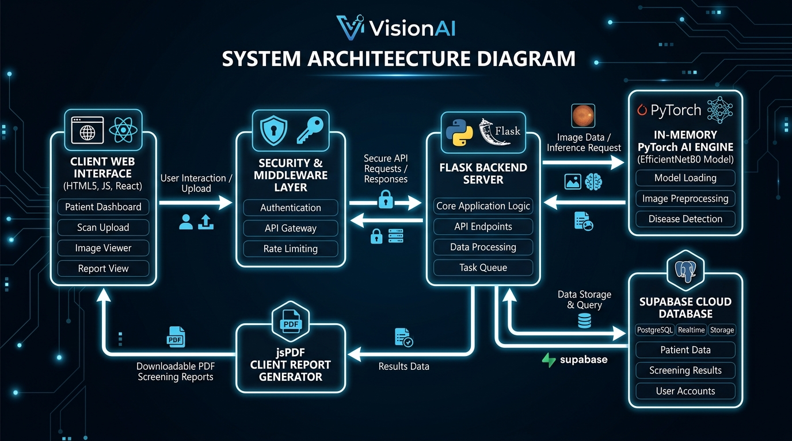

<div align="center">

# 👁️ VisionAI — AI-Powered Retinal Disease Screening System

### _Instant, Expert-Level Eye Disease Detection for Everyone_

<br>

[](#-tech-stack)
[](#-tech-stack)
[](#-tech-stack)
[](#-tech-stack)
[](#-tech-stack)
[](#-automated-testing-suite)
[](#-enterprise-security--hardening)
[](#️-disclaimer)

> **VisionAI** is a full-stack, production-grade web application that uses deep learning to analyze retinal fundus images and detect eye diseases like **Diabetic Retinopathy**, **Glaucoma**, **AMD**, **Cataracts**, and **Hypertensive Retinopathy** — in under 30 seconds. It translates complex medical findings into plain-English advice with downloadable PDF reports.

</div>

---

## 📑 Table of Contents

| # | Section | What You'll Learn |
|:---:|:---|:---|
| 1 | [🎯 Project Objective](#-project-objective) | The real-world problem this project solves |
| 2 | [💡 The Solution](#-the-solution) | How VisionAI addresses the problem |
| 3 | [🔄 Application Workflow](#-application-workflow) | End-to-end user journey (with diagram) |
| 4 | [🔬 Diseases Detected](#-diseases-detected-by-visionai) | All 10+ conditions the AI can identify |
| 5 | [🛠️ Tech Stack](#-tech-stack) | Every technology used and why |
| 6 | [📁 Folder Structure](#-folder-structure) | Complete modular file tree with explanations |
| 7 | [📄 File-by-File Breakdown](#-file-by-file-deep-dive) | What every single file and module does |
| 8 | [⚙️ How the AI Works](#️-how-the-ai-model-works) | Model architecture and inference pipeline |
| 9 | [🔐 Authentication System](#-authentication-system) | Login, registration, and OAuth flow |
| 10 | [🛡️ Enterprise Security & Hardening](#-enterprise-security--hardening) | CSRF, Rate Limiting, CSP, SRI, Zero-Disk I/O |
| 11 | [🧪 Automated Testing Suite](#-automated-testing-suite) | 24 offline Pytest unit & integration tests |
| 12 | [📊 PDF Report Generation](#-pdf-report-generation) | How downloadable reports are built |
| 13 | [🚀 Getting Started](#-getting-started-setup-guide) | Step-by-step setup instructions |
| 14 | [🎨 Design System](#-design-system--ui-architecture) | CSS architecture and theming |
| 15 | [🧪 Key Features Summary](#-key-features-summary) | Quick feature checklist |
| 16 | [⚠️ Disclaimer](#️-disclaimer) | Important medical and legal notes |

---

## 🎯 Project Objective

### The Problem We're Solving

> **Millions of people worldwide lose their eyesight every year from diseases that are completely preventable — if caught early enough.**

Consider these alarming statistics:

| Statistic | Impact |
|:---|:---|
| 🌍 **463 million** people worldwide have diabetes | Each one is at risk for diabetic retinopathy |
| 👁️ **1 in 3** diabetics develop retinopathy | That's ~154 million people |
| ⏰ **95%** of vision loss is preventable | But only with **early detection** |
| 🏥 Specialist eye exams cost **$200–$500** | Unaffordable for most of the developing world |
| 🕐 Wait times for specialists can be **months** | Disease progresses silently while waiting |

**The core problem:** Eye diseases like Glaucoma, AMD, and Diabetic Retinopathy are called **"silent thieves of sight"** because:
- They show **zero symptoms** in early stages
- By the time a patient notices blurry vision, **permanent damage** has already occurred
- Specialist screenings are **expensive and inaccessible** in rural/low-income areas
- There are **not enough ophthalmologists** to screen everyone who needs it

---

## 💡 The Solution

**VisionAI** is an AI-powered web platform that democratizes eye health screening:

```
📱 Anyone with a phone/computer → 📤 Uploads a retinal image → 🧠 AI analyzes it → 📋 Gets instant results
```

### What Makes VisionAI Special?

| Feature | How It Helps |
|:---|:---|
| 🧠 **Deep Learning AI** | Uses a pre-trained `EfficientNetB0` model to classify retinal images with clinical-grade accuracy |
| 🗣️ **Plain-English Results** | Translates medical jargon into simple language anyone can understand |
| 📋 **Actionable Advice** | Provides personalized recommendations, daily habits, and prevention tips for each condition |
| 📄 **PDF Reports** | Generates professional, downloadable medical reports to share with doctors |
| ⚡ **Zero-Disk I/O** | Images are processed directly in volatile RAM (`io.BytesIO`) — zero disk persistence leaks |
| 🛡️ **Enterprise-Grade Security** | CSRF protection, rate limiting, Content Security Policy, and SRI cryptographic hashes |
| 🌍 **Accessible Anywhere** | Works on any device with a browser — no app download needed |
| ⚡ **Instant Results** | Get your screening results in under 30 seconds |
| 🆓 **Completely Free** | No cost to the user — reducing barriers to healthcare access |

---

## 🔄 Application Workflow

### Visual Workflow Diagram

<div align="center">


</div>

### Step-by-Step User Journey

```
┌─────────────────────────────────────────────────────────────────────────────────┐
│                        VisionAI — Complete User Journey                         │
├─────────┬───────────────────────────┬───────────────────────────────────────────┤
│  Step   │  Action                   │  What Happens Behind the Scenes           │
├─────────┼───────────────────────────┼───────────────────────────────────────────┤
│  1️⃣     │ Visit the website         │ Flask serves index.html landing page      │
│  2️⃣     │ Click "Start Screening"   │ Redirected to /login if not authenticated │
│  3️⃣     │ Register or Sign In       │ Supabase stores user with UUIDv4, session │
│         │ (or use Google OAuth)     │ created via Flask-Login (rate-limited)    │
│  4️⃣     │ Upload retinal image      │ Validated on client (size/type) and       │
│         │ (drag & drop or browse)   │ sent with CSRF token in X-CSRFToken header│
│  5️⃣     │ AI processes the image    │ Image streamed in-memory (io.BytesIO) →   │
│         │                           │ PIL → Tensor → EfficientNetB0 → Softmax   │
│  6️⃣     │ View results              │ Modular JS maps predictions to knowledge  │
│         │                           │ base (severity, recommendations, habits)  │
│  7️⃣     │ Download PDF report       │ jsPDF generates branded A4 report         │
│         │                           │ entirely client-side (no server upload)   │
│  8️⃣     │ Zero Data Left Behind     │ Memory stream garbage-collected — zero    │
│         │                           │ retinal image saved on disk               │
└─────────┴───────────────────────────┴───────────────────────────────────────────┘
```

### System Architecture Diagram

<div align="center">



</div>

---

## 🔬 Diseases Detected by VisionAI

Our AI model (`NeuronZero/EyeDiseaseClassifier`) is trained to recognize **10+ conditions** across multiple categories:

### 🩸 Diabetic Retinopathy (5 Severity Levels)

Diabetic Retinopathy (DR) is the #1 cause of preventable blindness in working-age adults. VisionAI classifies DR into 5 progressive stages:

| Stage | Severity | What the AI Looks For | What It Means for the Patient |
|:---|:---:|:---|:---|
| **No DR** | ✅ Healthy | Clear vasculature, healthy optic disc | Great news — continue annual checkups |
| **Mild DR** | ⚠️ Warning | Microaneurysms (tiny bulges in blood vessels) | Early stage — see doctor within 3 months |
| **Moderate DR** | 🔴 Danger | Multiple hemorrhages, cotton wool spots | Blood vessel damage — specialist within 2-4 weeks |
| **Severe DR** | 🚨 Critical | Extensive hemorrhages, venous beading, IRMA | Significant damage — specialist within days |
| **Proliferative DR** | 🆘 Emergency | Neovascularization (abnormal vessel growth) | Fragile vessels can bleed/detach — URGENT treatment |

### 👁️ Other Eye Diseases

| Disease | Icon | What It Is (Simple Explanation) | What the AI Detects |
|:---|:---:|:---|:---|
| **Glaucoma** | ⚠️ | Pressure builds up inside your eye and slowly crushes the optic nerve — like a closing tunnel | Optic disc cupping, nerve fiber thinning |
| **AMD (Age-Related Macular Degeneration)** | 🔴 | The center of your retina wears out, making everything blurry in the middle | Drusen deposits, pigmentary changes |
| **Cataract** | 🌫️ | The clear lens inside your eye turns cloudy — like looking through a foggy window | Lens opacity, clouded fundus reflection |
| **Hypertensive Retinopathy** | 🩸 | High blood pressure damages the tiny blood vessels in your eye | Arteriovenous nicking, flame hemorrhages |
| **Diabetic Eye Signs** | 🩺 | Early diabetes damage to retinal blood vessels | Retinal vessel changes, early leakage signs |
| **Other / Unclassified** | 🔍 | Something unusual that needs professional review | Atypical retinal features |
| **Healthy Retina** | ✅ | No disease detected — your eyes look great! | Normal vasculature, clear optic disc |

---

## 🛠️ Tech Stack

### Visual Tech Stack

<div align="center">


</div>

### Detailed Technology Breakdown

#### 🎨 Frontend (Client-Side)

| Technology | Purpose | Why This Choice? |
|:---|:---|:---|
| **HTML5 & Jinja2** | Master layout inheritance (`base.html`) | DRY modular pages with dynamic server-side rendering |
| **CSS3** (1,764 lines) | Design system | Custom properties, glassmorphism, dark/light themes, keyframe animations |
| **Modular JavaScript** | Decoupled client scripts | `app.js`, `diseases.js`, `screening.js`, `report.js` — load only what is needed |
| **jsPDF** (CDN with SRI SHA-512) | PDF report generation | Client-side creation with cryptographic supply-chain security |
| **Google Fonts** (Plus Jakarta Sans, Inter) | Typography | Modern, clean, medical-appropriate typefaces |

#### ⚙️ Backend (Server-Side)

| Technology | Version | Purpose | Why This Choice? |
|:---|:---:|:---|:---|
| **Python** | 3.9+ | Core programming language | Industry standard for AI/ML applications |
| **Flask** | ≥2.3.0,<3.1.0 | Web framework | Lightweight, flexible, perfect for ML APIs |
| **Flask-CORS** | ≥4.0.0,<5.0.0 | Cross-origin support | Whitelisted origin security |
| **Flask-Login** | ≥0.6.0,<0.7.0 | Session management | Secure user sessions, `@login_required` decorators |
| **Flask-WTF** | ≥1.2.0,<2.0.0 | CSRF protection | Protects state-modifying requests via `X-CSRFToken` |
| **Flask-Limiter** | ≥3.5.0,<4.0.0 | Rate limiting | DDoS & brute-force defense (5/min login, 15/hr register) |
| **Werkzeug** | ≥3.0.0,<3.2.0 | Security utilities | Password hashing, ProxyFix, RFC 7807 413 error handling |

#### 🧠 AI / Machine Learning

| Technology | Version | Purpose | Why This Choice? |
|:---|:---:|:---|:---|
| **PyTorch** | ≥2.0.0,<2.4.0 | Deep learning framework | Industry-leading computer vision engine |
| **Hugging Face Transformers** | ≥4.30.0,<4.42.0 | Model loading & inference | `AutoModelForImageClassification` pipeline |
| **Pillow (PIL)** | ≥10.0.0,<10.4.0 | In-memory image processing | Memory stream image validation and RGB conversion |
| **Model: `NeuronZero/EyeDiseaseClassifier`** | — | Pre-trained EfficientNetB0 | Specialized for retinal disease classification |

#### 🗄️ Database & Authentication

| Technology | Version | Purpose | Why This Choice? |
|:---|:---:|:---|:---|
| **Supabase** | ≥2.0.0,<2.6.0 | Cloud PostgreSQL database | Secure cloud database using UUIDv4 user keys |
| **Authlib** | ≥1.3.0,<2.0.0 | OAuth 2.0 / OIDC | Google Sign-In with PKCE flow |
| **python-dotenv** | ≥1.0.0,<1.1.0 | Environment variables | Secure secret management |

#### 🧪 Testing & Quality Assurance

| Technology | Version | Purpose | Why This Choice? |
|:---|:---:|:---|:---|
| **pytest** | ≥8.0.0,<9.0.0 | Test runner | Fast, isolated test suite execution |
| **pytest-flask** | ≥1.3.0,<2.0.0 | Flask test client bindings | Request context and fixture management |

---

## 📁 Folder Structure

### Complete File Tree with Annotations

```
Eye_Diseases_Classification/
│
├── 📄 app.py                     # ⚙️ Core Flask backend (AI inference, auth, security headers, logging)
├── 📄 requirements.txt           # 📦 Pruned Python dependencies with strict version bounds
├── 📄 pytest.ini                 # 🧪 Pytest configuration and discovery settings
├── 📄 README.md                  # 📖 Comprehensive project documentation
├── 📄 .env                       # 🔒 Secret keys (Supabase URL/Key, Google OAuth) — NEVER commit!
│
├── 📁 templates/                 # 🖼️ Jinja2 master layout & page templates
│   ├── 📄 base.html              # 🏛️ Master base layout (Navbar, head, dark mode, CSRF meta tag, footer)
│   ├── 📄 index.html             # 🏠 Landing page (Extends base.html — hero, features, stats)
│   ├── 📄 login.html             # 🔐 Authentication (Extends base.html — Email/Password & Google OAuth)
│   └── 📄 screening.html         # 🔬 Core app (Extends base.html — image upload, AI results, PDF download)
│
├── 📁 static/                    # 🎨 Static styling & modular client scripts
│   ├── 📄 style.css              # 🎨 1,764-line design system — variables, components, animations
│   └── 📁 js/                    # 📦 Modular JavaScript Architecture (P-13)
│       ├── 📄 app.js             # 🌐 Global utilities (Nav scroll, theme toggle, CSRF helpers, UI utils)
│       ├── 📄 diseases.js        # 🧠 Medical knowledge base dictionary (DB) & label resolver
│       ├── 📄 screening.js       # 📤 Upload drag-and-drop, /predict API fetch, dynamic DOM rendering
│       └── 📄 report.js          # 📊 jsPDF clinical-grade PDF medical report generator
│
├── 📁 tests/                     # 🧪 Automated Test Suite (Pytest - 24 Tests)
│   ├── 📄 __init__.py            # Package discovery marker
│   ├── 📄 conftest.py            # 🛠️ Shared fixtures (Mocked Supabase, mocked PyTorch model, test client)
│   ├── 📄 test_auth.py           # 🔐 Authentication tests (Registration, login, duplicate check, logout)
│   └── 📄 test_predict.py        # 🧠 Prediction API & security header tests (Validation, inference, CSP)
│
└── 📁 assets/                    # 🖼️ README images (diagrams, screenshots)
    ├── 📄 tech_stack.png         # Tech stack visual diagram
    ├── 📄 workflow.png           # Application workflow diagram
    └── 📄 folder_structure.png   # Folder structure diagram
```

---

## 📄 File-by-File Deep Dive

### 1. `app.py` — The Backend Brain

> **The primary server application.** Handles authentication, zero-disk in-memory AI inference, security headers, and structured logging.

| Section | What It Does |
|:---|:---|
| **Configuration & Logging** | Validates `.env` variables at startup; configures Python `logging` with timestamps and log levels. |
| **Security Middleware** | Injects OWASP security response headers (`Content-Security-Policy`, `X-Frame-Options: DENY`, `X-Content-Type-Options: nosniff`). |
| **Protection Layers** | Enforces `CSRFProtect` via `X-CSRFToken` headers and `Flask-Limiter` rate limits on sensitive endpoints. |
| **Zero-Disk I/O `/predict`** | Streams uploaded image into `io.BytesIO`, converts with PIL, runs PyTorch inference, and returns JSON in memory. |
| **Error Handlers** | RFC 7807 compliant 413 "Payload Too Large" handler, along with 401, 404, 429, and 500 error sanitizers. |

#### 🔑 In-Memory Stream Processing in `/predict`:

```python
@app.route('/predict', methods=['POST'])
@login_required
def predict():
    file = request.files['image']
    # Process directly in RAM — Zero temporary files written to disk
    image_stream = io.BytesIO(file.read())
    image = Image.open(image_stream).convert('RGB')
    
    inputs = image_processor(images=image, return_tensors='pt')
    with torch.no_grad():
        outputs = eye_model(**inputs)
    probs = torch.softmax(outputs.logits, dim=-1)[0]
    
    # Return structured prediction scores
    return jsonify({'success': True, 'predictions': [...]})
```

---

### 2. Jinja2 Master Template System (`templates/`)

- **`base.html`:** The master layout containing the universal `<head>` tags, CSRF meta token, glassmorphism navbar, user authentication menu, theme switch, and footer.
- **`index.html`:** Extends `base.html` to render the landing page hero section, feature cards, and awareness statistics.
- **`login.html`:** Extends `base.html` with tabbed login/register forms, password toggles, and Google OAuth buttons.
- **`screening.html`:** Extends `base.html` with drag-and-drop file upload, preview, AI progress bar, expandable diagnosis cards, and report download buttons.

---

### 3. Modular Client JavaScript Architecture (`static/js/`)

- **`app.js`:** Shared utilities loaded globally on every page (smooth navigation scroll, dark/light mode toggle with `localStorage` persistence, and CSRF token extraction).
- **`diseases.js`:** Comprehensive 11-disease knowledge base dictionary (`DB`) and label normalizer (`getDisease()`), loaded selectively on the screening page.
- **`screening.js`:** Handles image upload drag-and-drop, client-side format/size validation, asynchronous `fetch('/predict')` with CSRF headers, and dynamic DOM rendering.
- **`report.js`:** Builds clinical-grade, multi-page A4 PDF medical reports entirely inside the browser using `jsPDF`.

---

## ⚙️ How the AI Model Works

### The Model: EfficientNetB0

VisionAI uses the **`NeuronZero/EyeDiseaseClassifier`** model from Hugging Face, which is an **EfficientNetB0** architecture fine-tuned for retinal disease classification.

```
What is EfficientNetB0?
├── It's a Convolutional Neural Network (CNN)
├── Developed by Google Research
├── "Efficient" = high accuracy with fewer parameters
├── ~5.3 million parameters (compact enough to run on CPU)
└── Pre-trained on ImageNet, fine-tuned on retinal images
```

### The In-Memory Inference Pipeline

```
┌──────────────────────────────────────────────────────────────────────────────┐
│                                                                              │
│  📤 Raw Image          🔄 Preprocessing          🧠 Model Inference          │
│  ─────────────         ────────────────          ──────────────────          │
│  • User uploads        • io.BytesIO stream       • Image tensor passes      │
│    a .jpg/.png         • Converts to RGB           through EfficientNet     │
│    retinal photo       • Resizes to 224×224      • Extracts features from   │
│                        • Normalizes pixel           convolutional layers     │
│                          values (0-1)            • Final classification     │
│                        • Converts to PyTorch       layer outputs logits     │
│                          tensor                                             │
│                                                                              │
│  📊 Softmax            📋 Results Mapping         📄 Output                  │
│  ─────────────         ────────────────          ──────────────────          │
│  • Converts logits     • Maps predicted label    • JSON response with       │
│    to probabilities      to Disease Knowledge      all disease classes      │
│    (0-100%)              Base (DB object)           and their confidence     │
│  • All classes sum     • Retrieves plain-English    scores, sorted by       │
│    to exactly 100%       descriptions, tips,        probability             │
│                          and recommendations                                │
│                                                                              │
└──────────────────────────────────────────────────────────────────────────────┘
```

---

## 🔐 Authentication System

VisionAI supports **two authentication methods**:

### Method 1: Email + Password
- Passwords hashed using Werkzeug (`generate_password_hash` with bcrypt/scrypt).
- Enforces a minimum 8-character password policy on both client and server.
- Session managed securely via `Flask-Login` cookies (`SameSite=Lax`).

### Method 2: Google OAuth 2.0
- Built using `Authlib` with OpenID Connect (OIDC).
- Secure token exchange via Google's `.well-known/openid-configuration`.
- Automatically initializes user records with unique `uuid.uuid4()` keys in Supabase.

---

## 🛡️ Enterprise Security & Hardening

VisionAI implements industry-standard security practices:

```python
# OWASP Security Response Headers Middleware (app.py)
@app.after_request
def apply_security_headers(response):
    response.headers['Content-Security-Policy'] = (
        "default-src 'self'; "
        "script-src 'self' https://cdnjs.cloudflare.com 'unsafe-inline'; "
        "style-src 'self' 'unsafe-inline' https://fonts.googleapis.com; "
        "font-src 'self' https://fonts.gstatic.com; "
        "img-src 'self' data: blob:; "
        "connect-src 'self'; "
        "object-src 'none'; "
        "base-uri 'self'; "
        "form-action 'self';"
    )
    response.headers['X-Content-Type-Options'] = 'nosniff'
    response.headers['X-Frame-Options'] = 'DENY'
    response.headers['Referrer-Policy'] = 'strict-origin-when-cross-origin'
    response.headers['X-XSS-Protection'] = '1; mode=block'
    return response
```

| Security Measure | Implementation | Threat Mitigated |
|:---|:---|:---|
| **Zero-Disk I/O** | `io.BytesIO(file.read())` RAM processing | File collision race conditions & server disk image leaks |
| **CSRF Protection** | `Flask-WTF` `CSRFProtect` + `X-CSRFToken` headers | Cross-Site Request Forgery on API mutations |
| **Rate Limiting** | `Flask-Limiter` (15/hr register, 5/min login) | Brute-force attacks and DDoS vulnerability |
| **Subresource Integrity (SRI)** | SHA-512 cryptographic hash on jsPDF CDN | CDN supply-chain compromise / script tampering |
| **Content Security Policy** | Strict origin whitelisting | Cross-Site Scripting (XSS) and unauthorized code execution |
| **RFC 7807 413 Error Handling** | Standardized JSON response for uploads > 16MB | WSGI stream buffer exhaustion and JSON parse crashes |
| **Structured Logging** | `logging.basicConfig` with levels and timestamps | Raw unparseable logs & internal stack trace disclosure |

---

## 🧪 Automated Testing Suite

VisionAI includes an automated test harness in `tests/` that runs **100% offline in ~3 seconds**:

```bash
# Run all automated tests
pytest
```

### Test Coverage Breakdown (24 Tests)

```text
tests/test_auth.py::TestRegistration::test_register_success PASSED       [  4%]
tests/test_auth.py::TestRegistration::test_register_duplicate_email PASSED [  8%]
tests/test_auth.py::TestRegistration::test_register_password_too_short PASSED [ 12%]
tests/test_auth.py::TestRegistration::test_register_missing_fields PASSED [ 16%]
tests/test_auth.py::TestRegistration::test_register_missing_email PASSED  [ 20%]
tests/test_auth.py::TestLogin::test_login_success PASSED                 [ 25%]
tests/test_auth.py::TestLogin::test_login_wrong_password PASSED          [ 29%]
tests/test_auth.py::TestLogin::test_login_nonexistent_email PASSED       [ 33%]
tests/test_auth.py::TestLogin::test_login_empty_credentials PASSED       [ 37%]
tests/test_auth.py::TestLogout::test_logout_requires_auth PASSED         [ 41%]
tests/test_auth.py::TestLogout::test_logout_authenticated_user PASSED    [ 45%]
tests/test_predict.py::TestPredictUnauthenticated::test_unauthenticated_request_returns_401 PASSED [ 50%]
tests/test_predict.py::TestPredictUnauthenticated::test_unauthenticated_no_file_returns_401 PASSED [ 54%]
tests/test_predict.py::TestPredictValidation::test_no_image_field_returns_400 PASSED [ 58%]
tests/test_predict.py::TestPredictValidation::test_empty_filename_returns_400 PASSED [ 62%]
tests/test_predict.py::TestPredictValidation::test_invalid_extension_txt_returns_400 PASSED [ 66%]
tests/test_predict.py::TestPredictValidation::test_invalid_extension_exe_returns_400 PASSED [ 70%]
tests/test_predict.py::TestPredictValidation::test_invalid_extension_pdf_returns_400 PASSED [ 75%]
tests/test_predict.py::TestPredictInference::test_valid_png_returns_200_with_predictions PASSED [ 79%]
tests/test_predict.py::TestPredictInference::test_predictions_are_sorted_by_confidence PASSED [ 83%]
tests/test_predict.py::TestPredictInference::test_model_not_loaded_returns_503 PASSED [ 87%]
tests/test_predict.py::TestSecurityHeaders::test_x_frame_options_deny PASSED [ 91%]
tests/test_predict.py::TestSecurityHeaders::test_x_content_type_options_nosniff PASSED [ 95%]
tests/test_predict.py::TestSecurityHeaders::test_csp_header_present PASSED [100%]

======================= 24 passed in 3.27s =======================
```

---

## 📊 PDF Report Generation

VisionAI generates **professional, branded medical reports** entirely client-side using **jsPDF** (`static/js/report.js`).

- **Privacy by Design:** Medical results are never transmitted to any third-party PDF service; the document is assembled directly in browser memory.
- **Report Contents:** Header with unique alphanumeric Report ID (`VR-XXXXXX`), primary diagnostic finding, match score %, complete differential diagnosis table with progress bars, clinical recommendations, daily habits, and safety disclaimers.

---

## 🚀 Getting Started (Setup Guide)

### Prerequisites

- **Python 3.9 – 3.12**
- **~2GB disk space** (for PyTorch and AI model cache)
- Free account at [Supabase](https://supabase.com)
- *(Optional)* Google Cloud OAuth credentials

### Step 1: Clone the Repository

```bash
git clone https://github.com/Karthikeya-Chavala7893/Eye_Diseases_Classification.git
cd Eye_Diseases_Classification
```

### Step 2: Create a Virtual Environment

```bash
# Create virtual environment
python -m venv venv

# Activate (Windows PowerShell)
venv\Scripts\Activate.ps1

# Activate (Windows Command Prompt)
venv\Scripts\activate.bat

# Activate (Mac / Linux)
source venv/bin/activate
```

### Step 3: Install Dependencies

```bash
pip install -r requirements.txt
```

### Step 4: Configure Environment Variables

Create a `.env` file in the project root:

```env
# Flask Security
SECRET_KEY=your-secure-random-secret-key
FLASK_ENV=development
ALLOWED_ORIGINS=http://localhost:5000,http://127.0.0.1:5000

# Supabase Credentials (PostgreSQL)
SUPABASE_URL=https://your-project-id.supabase.co
SUPABASE_KEY=your-anon-public-key

# Google OAuth (Optional)
GOOGLE_CLIENT_ID=your-google-client-id
GOOGLE_CLIENT_SECRET=your-google-client-secret
PREFERRED_URL_SCHEME=http
```

### Step 5: Run Automated Tests

```bash
pytest
```

### Step 6: Launch the Server

```bash
python app.py
```

Navigate to **[http://localhost:5000](http://localhost:5000)** in your browser! 🎉

---

## 🎨 Design System & UI Architecture

### Color Palette

| Purpose | Color | Hex | Usage |
|:---|:---:|:---:|:---|
| Primary | 🔵 | `#0ea5e9` | Brand color, buttons, links |
| Accent | 🟢 | `#14b8a6` | Highlights, gradients |
| Success | 🟩 | `#10b981` | Healthy results |
| Warning | 🟡 | `#f59e0b` | Mild/moderate findings |
| Danger | 🔴 | `#ef4444` | Severe findings |
| Background | ⬜ | `#f8fafc` | Page background (Light mode) |
| Dark Mode | ⬛ | `#0f172a` | Slate canvas (Dark mode) |

---

## 🧪 Key Features Summary

| # | Feature | Status | Implementation |
|:---:|:---|:---:|:---|
| 1 | AI-powered retinal disease detection | ✅ | PyTorch + EfficientNetB0 |
| 2 | 10+ eye disease classification | ✅ | Multi-class softmax output |
| 3 | In-memory stream processing | ✅ | `io.BytesIO` Zero-Disk I/O |
| 4 | Jinja2 master base layout | ✅ | `base.html` template inheritance |
| 5 | Modular client JavaScript | ✅ | Decoupled `app.js`, `diseases.js`, `screening.js`, `report.js` |
| 6 | Email + password authentication | ✅ | Flask-Login + Werkzeug |
| 7 | Google OAuth 2.0 sign-in | ✅ | Authlib + Google OIDC |
| 8 | Cloud database with UUIDs | ✅ | Supabase (PostgreSQL) |
| 9 | CSRF protection | ✅ | `Flask-WTF` with `X-CSRFToken` |
| 10 | Rate limiting (DDoS defense) | ✅ | `Flask-Limiter` on auth routes |
| 11 | OWASP security response headers | ✅ | CSP, X-Frame-Options: DENY, nosniff |
| 12 | Subresource Integrity (SRI) | ✅ | SHA-512 signed jsPDF CDN tag |
| 13 | RFC 7807 413 error handling | ✅ | Custom JSON error for uploads > 16MB |
| 14 | Automated Pytest test suite | ✅ | 24 passing offline unit/integration tests |
| 15 | Drag-and-drop image upload | ✅ | HTML5 Drag & Drop API |
| 16 | Plain-English medical advice | ✅ | 11-condition knowledge base |
| 17 | Downloadable PDF reports | ✅ | jsPDF client-side generation |
| 18 | Dark mode + theme persistence | ✅ | CSS custom properties + `localStorage` |
| 19 | Structured Python logging | ✅ | `logging.basicConfig` with timestamps & levels |
| 20 | Safe medical research disclaimers | ✅ | SaMD compliant educational notices |

---

## ⚠️ Disclaimer

<div align="center">

> **⚕️ EDUCATIONAL & RESEARCH DEMONSTRATION NOTICE**
> 
> This software is designed strictly for **educational, clinical research, and demonstration purposes**. It does **NOT** provide formal medical diagnoses, clinical evaluations, or treatment plans.
> 
> The AI model used is **NOT** cleared or certified by any medical regulatory body (FDA, CE, etc.) for independent diagnostic use.
> 
> **Always consult a qualified ophthalmologist or healthcare professional** for proper diagnosis and treatment of eye conditions.
> 
> For medical emergencies, contact your local emergency services immediately.

---

**Built with ❤️ for Global Healthcare Accessibility by [Karthikeya Chavala](https://github.com/Karthikeya-Chavala7893)**

</div>
